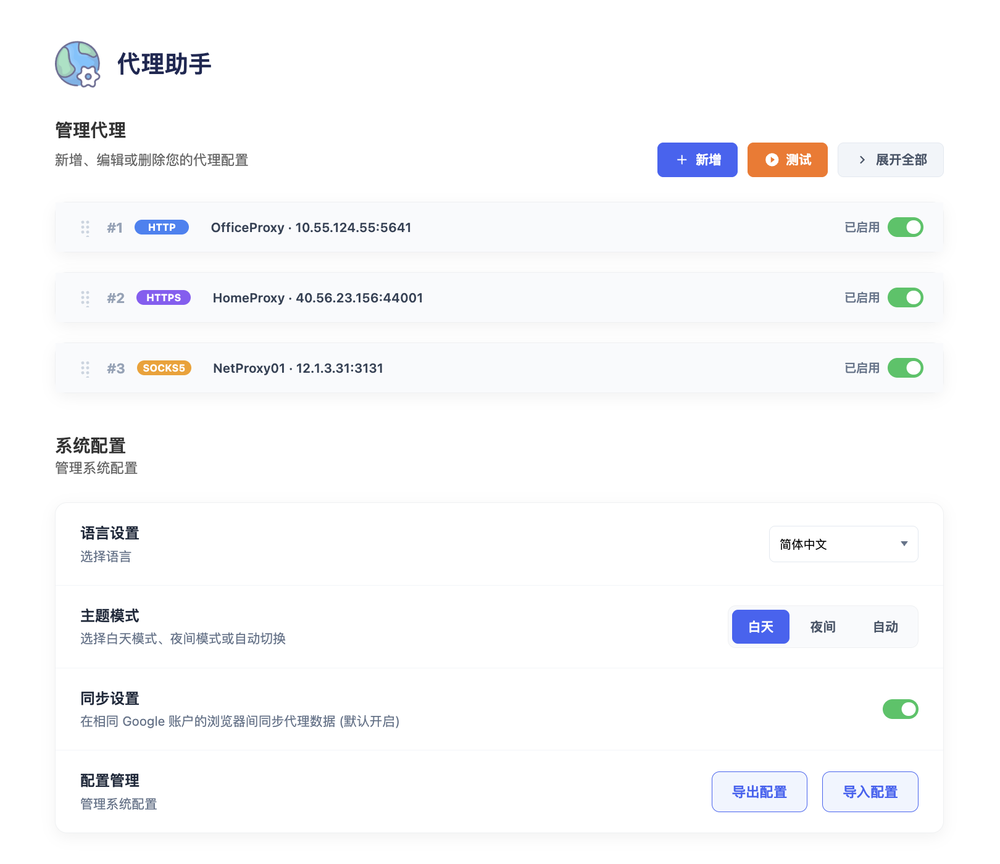
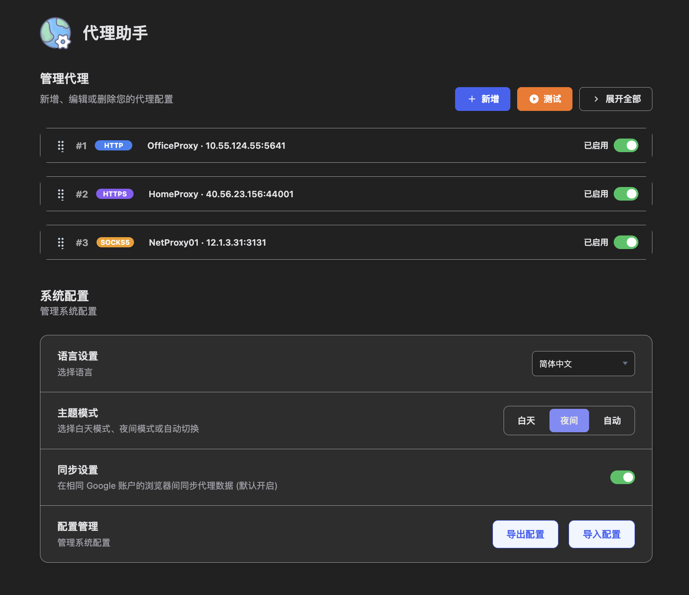
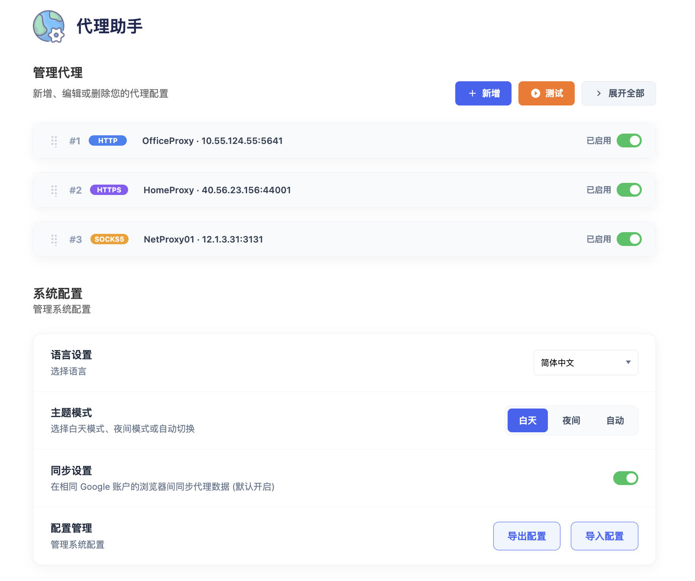
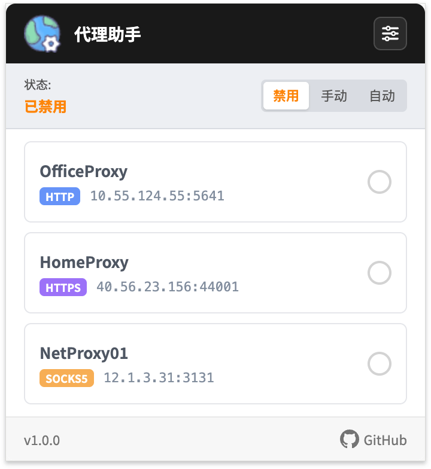
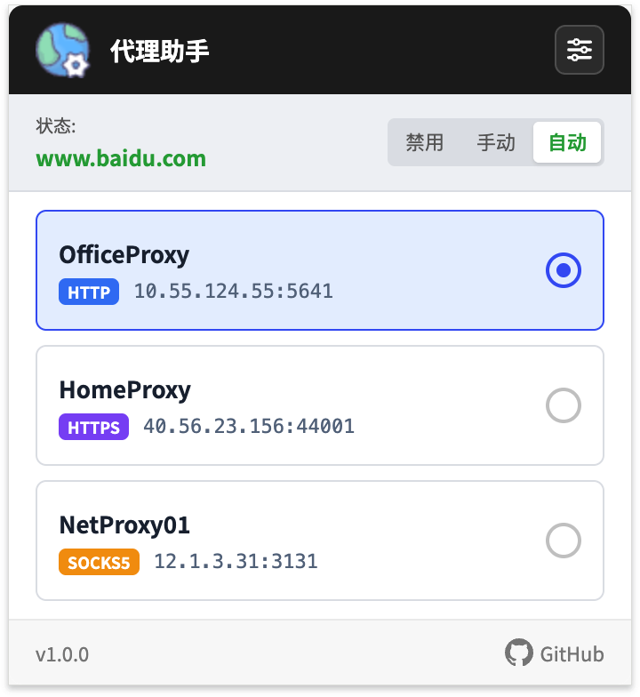

<div align="center">


<h1 style="display: inline; vertical-align: middle; line-height: 128px;">Proxy Assistant</h1>

</div>

<div align="center">

[](https://chrome.google.com/webstore)
[](https://developer.chrome.com/docs/extensions/mv3/intro/)
[](README.md)

A powerful Chrome browser proxy management extension that helps you easily configure and switch between different network proxies.

## ✨ Features

### 🔌 Multiple Proxy Protocol Support
- **HTTP** - Traditional HTTP proxy
- **HTTPS** - Secure HTTPS proxy
- **SOCKS5** - SOCKS5 proxy with TCP/UDP support
- **SOCKS4** - Legacy SOCKS4 proxy compatibility

### 🔄 Three Proxy Modes

| Mode | Description |
|------|-------------|
| **Disable** | Turn off proxy, use system default network connection |
| **Manual** | Manually select a proxy from the list |
| **Auto** | Automatically select matching proxy based on URL rules (PAC mode) |

### 📋 Flexible URL Rule Configuration

- **Addresses bypassing proxy** (`bypass_urls`): Direct connection domains/IPs
- **Addresses using proxy** (`include_urls`): Domains requiring proxy access
- Supports wildcard `*` and domain matching
- Suitable for scenarios where different websites use different proxies

### 🔐 Proxy Authentication Support

- Username/password authentication support
- Automatic handling of proxy server authentication requests
- Secure credential storage

### 🧪 Proxy Testing Features

- **Connection Test**: Verify proxy availability
- **Latency Measurement**: Test proxy response time
- **Batch Testing**: Test all proxies with one click
- **Color Indicators**: Green(<500ms) / Orange(≥500ms) / Red(Failed)

### 🌙 Theme Modes

- **Light Mode**: For daytime use
- **Dark Mode**: For nighttime use
- **Auto Switch**: Automatically switch theme based on time

|  |  |
|:---:|:---:|
| Light Mode | Dark Mode |

### ☁️ Data Sync

- **Google Account Sync**: Sync proxy configurations across devices
- **Local Storage**: Option to save locally only

### 🌍 Multi-language Support

- Simplified Chinese (zh-CN)
- Traditional Chinese (zh-TW)
- English (en)
- Japanese (ja)
- French (fr)

## 📷 Screenshots

### Main Interface


### Popup Interface


|  |  |  |
|:---:|:---:|:---:|
| Popup 01 | Popup 02 | Popup 03 |

## 📁 Project Structure

```
chrome_extension_proxy/
├── manifest.json              # Chrome extension configuration
├── main.html                  # Settings page
├── popup.html                 # Popup page
├── js/
│   ├── main.js               # Settings page main logic
│   ├── popup.js              # Popup main logic
│   ├── service-worker.js     # Background service (proxy core logic)
│   ├── i18n.js               # Internationalization support
│   └── jquery.js             # jQuery library
├── css/
│   ├── main.css              # Settings page styles
│   ├── popup.css             # Popup styles
│   ├── theme.css             # Theme styles
│   ├── switch.css            # Switch component styles
│   ├── delete-button.css     # Delete button styles
│   └── eye-button.css        # Password visibility button styles
└── images/                   # Icon resources
    ├── icon-16.png
    ├── icon-32.png
    ├── icon-48.png
    ├── icon-128.png
    └── logo-128.png
```

## 🚀 Quick Start

### Installing the Extension

1. Open Chrome browser and navigate to `chrome://extensions/`
2. Enable **"Developer mode"** in the top right corner
3. Click **"Load unpacked"**
4. Select the `chrome_extension_proxy` folder

### Adding a Proxy

1. Click the extension icon to open the popup
2. Click the **"Settings"** button to open the settings page
3. Click the **"New"** button to add a new proxy
4. Fill in the proxy information:
   - Proxy name
   - Protocol type (HTTP/HTTPS/SOCKS5)
   - Proxy address (IP or domain)
   - Port number
   - (Optional) Username and password
5. Click the **"Save"** button

### Using Proxies

**Manual Mode**:
1. Select **"Manual"** mode in the popup
2. Select a proxy from the list
3. Status showing "Connected" indicates it's active

**Auto Mode**:
1. Select **"Auto"** mode in the popup
2. Configure URL rules for each proxy in the settings page
3. Proxies are automatically selected based on the website you're visiting

## 📖 Detailed Documentation

### URL Rule Syntax

Supports the following matching rules:

```
# Exact match
google.com

# Subdomain match
.google.com
www.google.com

# Wildcard match
*.google.com
*.twitter.com

# IP address
192.168.1.1
10.0.0.0/8
```

### PAC Script Auto Mode

Auto mode uses PAC (Proxy Auto-Config) scripts:
- Automatically selects proxy based on the current URL
- Supports fallback policies (direct connection or reject)
- Automatically restores last configuration on browser startup

### Keyboard Shortcuts

| Action | Method |
|--------|--------|
| Expand/Collapse proxy card | Click on card header |
| Expand/Collapse all cards | Click "Expand All" button |
| Drag to reorder proxy | Drag the handle on card header |
| Show/Hide password | Click the eye icon on password field |
| Test single proxy | Click "Test" button |
| Test all proxies | Click "Test All" button |

### Import/Export Configuration

1. **Export Config**: Click "Export Config" to download a JSON file
2. **Import Config**: Click "Import Config" and select a JSON file to restore

Configuration includes:
- All proxy information
- Theme settings
- Sync settings

## 🔧 Technical Architecture

### Manifest V3

- Uses Chrome Extension Manifest V3 specification
- Service Worker replaces background pages
- More secure and efficient architecture

### Core Modules

1. **service-worker.js**:
   - Proxy configuration management
   - PAC script generation
   - Authentication handling
   - Proxy testing logic

2. **popup.js**:
   - Popup interface interaction
   - Proxy status display
   - Quick proxy switching

3. **main.js**:
   - Settings page logic
   - Proxy management (CRUD)
   - Drag and drop sorting
   - Import/Export

4. **i18n.js**:
   - Multi-language support
   - Real-time language switching

### Data Storage

- `chrome.storage.local`: Local storage
- `chrome.storage.sync`: Cloud sync storage
- Automatic storage quota handling

## 📝 Use Cases

### Scenario 1: Multiple Proxy Switching

- Configure different proxies for different network environments
- Use company proxy for office network
- Use VPN proxy for home network
- Quick one-click switching

### Scenario 2: Smart Routing

- Domestic websites direct connection
- Specific websites through proxy
- Automatic selection based on domain

### Scenario 3: Proxy Pool Testing

- Import multiple proxies
- Batch test latency
- Select optimal proxy for use

### Scenario 4: Team Sharing

- Export configuration file
- Share with team members
- Unified proxy configuration

## ⚠️ Important Notes

1. **Permission Description**: The extension requires the following permissions:
   - `proxy`: Manage proxy settings
   - `storage`: Store configurations
   - `webRequest`: Handle authentication requests
   - `<all_urls>`: Access all website URLs

2. **Other Extension Conflicts**: If you experience proxy conflicts, please disable other proxy extensions

3. **Security**: Credentials are stored locally in the browser, please ensure your device is secure

4. **Network Requirements**: Ensure the proxy server is accessible

## 📄 License

MIT License - See [LICENSE](LICENSE) file for details

## 🤝 Contributing

Issue reports and Pull Requests are welcome!

## 📧 Contact

For questions or suggestions, please submit feedback via GitHub Issues.
