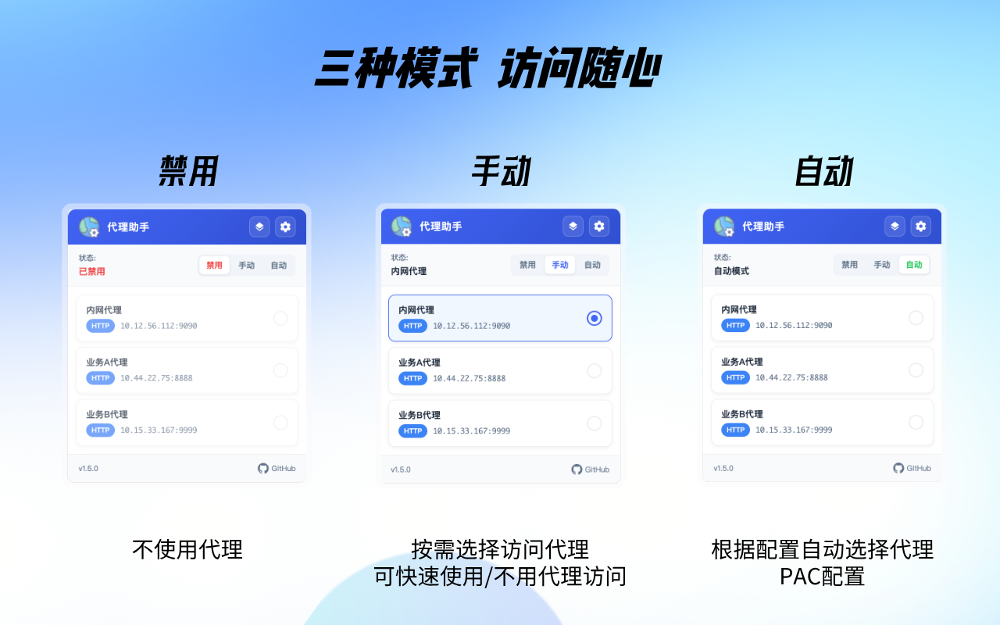
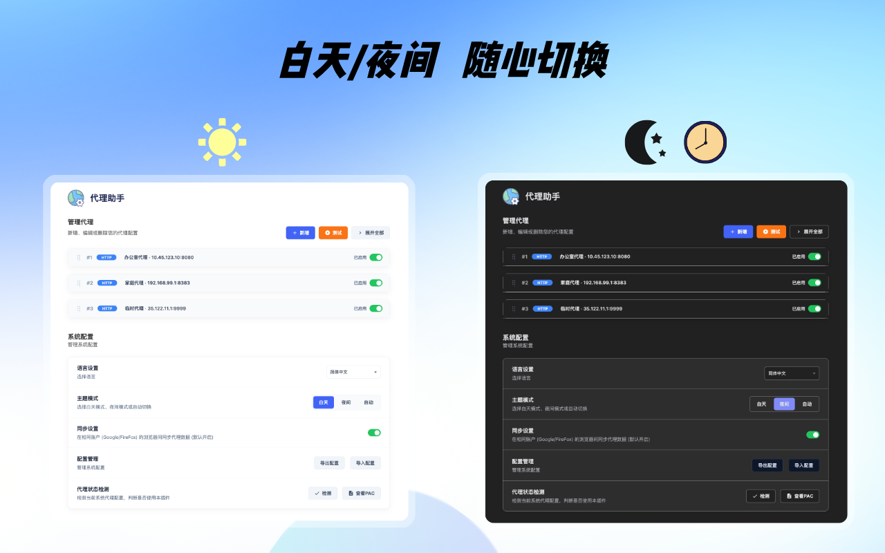
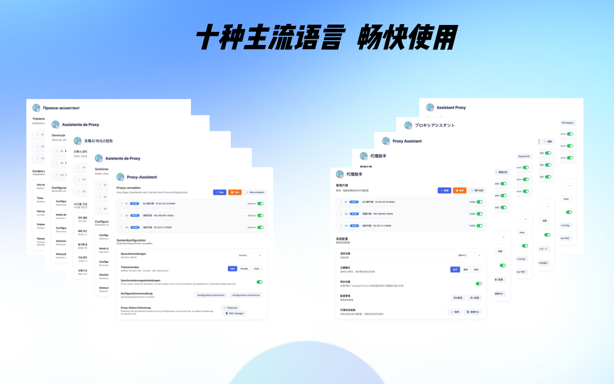
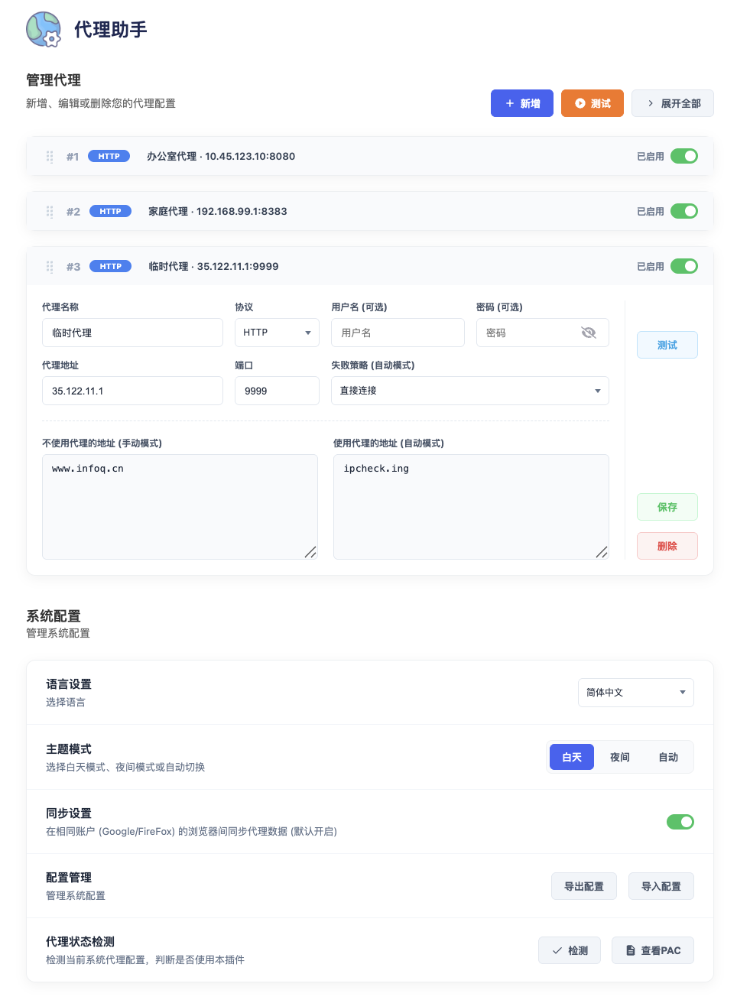

<div align="center">


# 代理助手

</div>

<div align="center">

[](https://chrome.google.com/webstore)
[](https://addons.mozilla.org/)
[](https://developer.chrome.com/docs/extensions/mv3/intro/)
[](README.md)

</div>

<div align="center">

[**简体中文**](README.md) | [繁體中文](readme/README-zh-TW.md) | [English](readme/README-en.md) | [日本語](readme/README-ja.md) | [Français](readme/README-fr.md) | [Deutsch](readme/README-de.md) | [Español](readme/README-es.md) | [Português](readme/README-pt.md) | [Русский](readme/README-ru.md) | [한국어](readme/README-ko.md)

</div>

<div align="center">

一款功能强大的浏览器代理管理扩展，支持 Chrome 和 Firefox，帮助您轻松配置和切换网络代理。

</div>


## 1. ✨ 功能特性

### 1.1 🔌 多协议代理支持
- **HTTP** - 传统 HTTP 代理
- **HTTPS** - 安全 HTTPS 代理
- **SOCKS5** - 支持 TCP/UDP 的 SOCKS5 代理
- **SOCKS4** - 兼容旧版 SOCKS4 代理

### 1.2 🌐 多浏览器支持
- **Chrome** - 使用 Manifest V3 + Service Worker
- **Firefox** - 使用 onRequest API 进行代理拦截

### 1.3 🔄 三种代理模式

| 模式 | 描述 |
|------|------|
| **禁用** | 禁用代理，使用系统默认网络连接 |
| **手动** | 从列表中手动选择代理 |
| **自动** | 根据 URL 规则自动选择匹配的代理 (PAC 模式) |



### 1.4 📋 灵活的 URL 规则配置

- **不走代理的地址** (`bypass_urls`): 手动模式下直接连接的域名/IP
- **走代理的地址** (`include_urls`): 自动模式下需要代理访问的域名
- **备用策略**: 自动模式下连接失败时选择直接连接或拒绝连接
- 支持通配符 `*` 和域名匹配
- 适用于不同网站使用不同代理的场景

### 1.5 🔐 代理认证支持

- 用户名/密码认证
- 自动处理代理服务器的认证请求
- 凭证信息的安全存储

### 1.6 🧪 代理测试功能

- **连接测试**: 检测代理可用性
- **延迟测量**: 测试代理响应时间
- **批量测试**: 一键测试所有代理
- **颜色指示**: 绿色(<500ms) / 橙色(≥500ms) / 红色(失败)

### 1.7 🏃 代理状态检测

- 检测浏览器当前代理设置
- 检测扩展是否成功接管代理控制
- 检测其他扩展是否抢占代理控制权
- 提供状态、警告、错误三种检测结果

### 1.8 🔍 PAC 脚本预览

- **脚本视图**: 查看自动生成的 PAC 脚本内容
- **规则列表**: 清晰展示所有生效的代理匹配规则
- **调试支持**: 方便排查自动模式下的匹配问题

### 1.9 🌙 主题模式

- **浅色模式**: 白天使用
- **深色模式**: 夜间使用
- **自动切换**: 根据时间自动切换主题（可配置时间段）



### 1.10 ☁️ 数据存储与同步

#### 1.10.1 存储策略

| 存储类型 | 存储内容 | 描述 |
|----------|----------|------|
| **本地存储 (local)** | 代理列表、主题设置、语言设置、同步配置 | 始终启用，确保离线可用和数据持久化 |
| **云端同步 (sync)** | 完整配置数据（分块存储） | 可选功能，使用分块存储绕过配额限制 |

#### 1.10.2 同步方式

##### 1.10.2.1 浏览器原生同步 (Native Sync)
- 使用 `chrome.storage.sync` API（Chrome）或 `browser.storage.sync`（Firefox）
- 通过 Chrome/Firefox 账号自动同步
- 适用于同一浏览器账号的多设备同步
- **分块存储**: 配置数据自动分块（每块 7KB）存储，绕过 8KB 单项配额限制
- **数据校验**: 使用校验和确保同步数据的完整性
- **原子操作**: Push 操作先清空旧数据再写入新数据，保证一致性
- **配额显示**: 实时显示已用/总配额（100KB）和分块数量

##### 1.10.2.2 GitHub Gist 同步
- 通过 GitHub Gist 在浏览器和设备间同步配置
- 需要配置 GitHub Personal Access Token
- 支持手动 push/pull 或自动同步
- 配置内容加密存储，导出时自动清除敏感信息

| 配置项 | 描述 |
|--------|------|
| **访问密钥** | GitHub Personal Access Token（需具有 gist 权限） |
| **文件名** | Gist 中的文件名，默认为 `proxy_assistant_config.json` |
| **Gist ID** | 自动识别保存，无需手动输入 |

#### 1.10.3 同步操作

| 操作 | 描述 |
|------|------|
| **Push** | 将本地配置上传至云端/Gist |
| **Pull** | 从云端/Gist 下载配置到本地 |
| **测试连接** | 验证 Gist Token 有效性及配置状态 |

#### 1.10.4 导入导出

- **导出配置**: 生成包含所有代理信息、主题设置、语言设置等信息的 JSON 文件
- **导入配置**: 支持从 JSON 文件恢复配置
- **数据安全**: 导出文件自动清除敏感信息（Token、密码）
- **格式兼容**: 支持导入旧版本配置文件

**导出结构:**
```json
{
  "version": 1,
  "settings": {
    "appLanguage": "zh-CN",
    "themeMode": "light",
    "nightModeStart": "22:00",
    "nightModeEnd": "06:00"
  },
  "sync": {
    "type": "native",
    "gist": { "filename": "proxy_assistant_config.json" }
  },
  "proxies": [
    {
      "name": "My Proxy",
      "protocol": "http",
      "ip": "192.168.1.1",
      "port": "8080",
      "username": "",
      "password": "",
      "fallback_policy": "direct",
      "include_urls": "",
      "bypass_urls": ""
    }
  ]
}
```

### 1.11 🌍 多语言支持

本扩展支持以下语言：

| 语言 | 代码 | 状态 |
|------|------|------|
| 简体中文 | zh-CN | ✅ 已支持 |
| 繁體中文 | zh-TW | ✅ 已支持 |
| English | en | ✅ 已支持 |
| 日本語 | ja | ✅ 已支持 |
| Français | fr | ✅ 已支持 |
| Deutsch | de | ✅ 已支持 |
| Español | es | ✅ 已支持 |
| Português | pt | ✅ 已支持 |
| Русский | ru | ✅ 已支持 |
| 한국어 | ko | ✅ 已支持 |



## 2. 📷 设置界面



## 3. 📁 项目结构

```
ProxyAssistant/
├── conf/                     # 示例配置
│   └── demo.json             # 示例配置文件
├── readme/                   # 多语言文档
│   ├── README-zh-TW.md       # 繁体中文
│   ├── README-en.md          # 英文
│   ├── README-ja.md          # 日文
│   ├── README-fr.md          # 法文
│   ├── README-de.md          # 德文
│   ├── README-es.md          # 西班牙文
│   ├── README-pt.md          # 葡萄牙文
│   ├── README-ru.md          # 俄文
│   └── README-ko.md          # 韩文
├── src/                      # 源代码
│   ├── manifest_chrome.json  # Chrome 扩展配置 (Manifest V3)
│   ├── manifest_firefox.json # Firefox 扩展配置
│   ├── main.html             # 设置页面
│   ├── popup.html            # 弹窗页面
│   ├── js/
│   │   ├── main.js           # 设置页面主逻辑
│   │   ├── popup.js          # 弹窗 UI 逻辑
│   │   ├── worker.js         # Service Worker (Chrome) / Background Script (Firefox)
│   │   ├── i18n.js           # 国际化支持
│   │   └── jquery.js         # jQuery 库
│   ├── css/
│   │   ├── main.css          # 设置页面样式 (含通用组件)
│   │   ├── popup.css         # 弹窗样式
│   │   ├── theme.css         # 主题样式
│   │   └── eye-button.css    # 显示密码按钮样式
│   └── images/               # 图片资源
│       ├── icon-16.png
│       ├── icon-32.png
│       ├── icon-48.png
│       ├── icon-128.png
│       └── logo-128.png
├── public/                   # 公共资源
│   └── img/                  # 演示和宣传图片
├── tests/                    # 测试目录
│   ├── jest.config.js        # Jest 测试配置
│   ├── setup.js              # 测试环境设置
│   ├── __mocks__/            # Mock 文件
│   │   └── chrome.js         # Chrome API Mock
│   ├── unit/                 # 单元测试
│   ├── integration/          # 集成测试
│   └── e2e/                  # 端到端测试
├── script/                   # 构建脚本
│   └── build.sh              # 扩展构建脚本
├── release/                  # 版本发布说明
│   └── *.md                  # 各版本更新日志
├── build/                    # 构建产物目录
├── package.json              # 项目依赖配置
├── package-lock.json         # 锁定依赖版本
├── Makefile                  # 构建命令入口
├── jest.config.js            # Jest 配置（指向 tests/jest.config.js）
└── AGENTS.md                 # 开发指南
```

## 4. 🚀 快速开始

### 4.1 安装扩展

#### 4.1.1 Chrome

**方式一（推荐）**: 从 Chrome 官方商店安装
1. 打开 Chrome，访问 [Chrome 网上应用店](https://chrome.google.com/webstore)
2. 搜索"代理助手"
3. 点击"添加至 Chrome"

**方式二**: 本地安装
- **方案 A（使用源码）**: 下载源码，将 `src/manifest_chrome.json` 重命名为 `manifest.json`，然后加载 `src` 目录
- **方案 B（使用安装包）**:
  1. 前往 [GitHub Releases](https://github.com/bugwz/ProxyAssistant/releases) 页面
  2. 下载 `proxy-assistant-chrome-x.x.x.zip` 文件
  3. 将下载的 ZIP 文件解压到任意目录
  4. 打开 Chrome，访问 `chrome://extensions/`
  5. 开启右上角的 **"开发者模式"**
  6. 点击左上角的 **"加载已解压的扩展程序"** 按钮
  7. 选择第 3 步解压的文件夹
  8. 安装成功后扩展会出现在扩展列表中

#### 4.1.2 Firefox

**方式一（推荐）**: 从 Firefox 官方附加组件安装
1. 打开 Firefox，访问 [Firefox 附加组件](https://addons.mozilla.org/)
2. 搜索"代理助手"
3. 点击"添加到 Firefox"

**方式二**: 本地安装
1. 从 release 目录下载 Firefox 扩展安装包（`.xpi` 文件）
2. 打开 Firefox，访问 `about:addons`
3. 点击 **齿轮图标** → **从文件安装附加组件**
4. 选择下载的 `.xpi` 文件

#### 4.1.3 Microsoft Edge

Edge 浏览器基于 Chromium 内核，可以直接安装 Chrome 扩展。

**方式一（推荐）**: 从 Chrome 网上应用店安装
1. 打开 Edge，访问 `edge://extensions/`
2. 在"发现新扩展"区域，点击"获取 Chrome 网上应用店中的扩展"，访问 [Chrome 网上应用店](https://chrome.google.com/webstore)
3. 搜索"代理助手"
4. 点击"获取"然后"添加到 Microsoft Edge"

**方式二**: 本地安装
1. 前往 [GitHub Releases](https://github.com/bugwz/ProxyAssistant/releases) 页面
2. 下载 `proxy-assistant-chrome-x.x.x.zip` 文件
3. 将下载的 ZIP 文件解压到任意目录
4. 打开 Edge，访问 `edge://extensions/`
5. 开启左下角的 **"开发者模式"**
6. 点击 **"选择解压缩的目录"** 按钮
7. 选择第 3 步解压的文件夹
8. 安装成功后扩展会出现在扩展列表中

### 4.2 添加代理

1. 点击扩展图标打开弹窗
2. 点击 **"设置"** 按钮打开设置页面
3. 点击 **"新增代理"** 按钮添加新的代理
4. 填写代理信息：
   - 代理名称
   - 协议类型 (HTTP/HTTPS/SOCKS4/SOCKS5)
   - 代理地址 (IP 或域名)
   - 端口号
   - (可选) 用户名和密码
   - (可选) URL 规则配置
5. 点击 **"保存"** 按钮

### 4.3 使用代理

**手动模式**:
1. 在弹窗中选择 **"手动"** 模式
2. 从列表中选择代理
3. 状态显示"已连接"表示已生效

**自动模式**:
1. 在弹窗中选择 **"自动"** 模式
2. 在设置页面为每个代理配置 URL 规则
3. 根据访问的网站自动选择代理

## 5. 🛠️ 开发指南

### 5.1 开发环境

**前置要求**:
- Node.js >= 14
- npm >= 6
- Chrome / Firefox 浏览器（用于测试）
- web-ext（用于构建 Firefox XPI，可选）

**安装依赖**:
```bash
make test_init
# 或
npm install
```

### 5.2 测试命令

| 命令 | 描述 |
|------|------|
| `make test` | 运行所有测试（单元 + 集成 + e2e） |
| `make test_nocache` | 不使用缓存运行测试 |
| `make test_unit` | 仅运行单元测试 |
| `make test_integration` | 仅运行集成测试 |
| `make test_e2e` | 仅运行 e2e 测试 |
| `make test_watch_nocache` | 监听模式运行测试 |
| `make test_cov_nocache` | 运行测试并生成覆盖率报告 |

**直接使用 npm**:
```bash
npm test                    # 运行所有测试
npm run test:unit           # 仅运行单元测试
npm run test:integration    # 仅运行集成测试
npm run test:e2e            # 仅运行 e2e 测试
npm run test:watch          # 监听模式运行测试
npm run test:coverage       # 运行测试并生成覆盖率报告
```

### 5.3 构建命令

| 命令 | 描述 |
|------|------|
| `make build` | 构建 Chrome 和 Firefox 扩展 |
| `make clean` | 清理构建产物 |
| `make test_clean` | 清理测试缓存和覆盖率文件 |

**指定版本号**:
```bash
make build VERSION=1.3.1
# 或
./script/build.sh 1.3.1
```

**构建产物**:
```
build/
├── ProxyAssistant_{VERSION}_chrome.zip      # Chrome 安装包
├── ProxyAssistant_{VERSION}_chrome.tar.gz   # Chrome 源码包
├── ProxyAssistant_{VERSION}_firefox.zip     # Firefox 安装包
├── ProxyAssistant_{VERSION}_firefox.tar.gz  # Firefox 源码包
└── ProxyAssistant_{VERSION}_firefox.xpi     # Firefox 官方扩展包
```

### 5.4 本地开发测试

**Chrome 本地安装**:
1. 修改 `src/manifest_chrome.json` 为 `manifest.json`
2. 打开 Chrome，访问 `chrome://extensions/`
3. 开启 **"开发者模式"**
4. 点击 **"加载已解压的扩展程序"**
5. 选择 `src` 目录

**Firefox 本地安装**:
1. 使用 `make build` 生成 XPI 文件
2. 打开 Firefox，访问 `about:addons`
3. 点击 **齿轮图标** → **从文件安装附加组件**
4. 选择生成的 `.xpi` 文件

### 5.5 代码风格

- **缩进**: 2 个空格
- **引号**: 单引号
- **命名**: 小驼峰 (camelCase)，常量使用大写下划线
- **分号**: 一致使用

详细规范请参考 [AGENTS.md](AGENTS.md)

## 6. 📖 详细文档

### 6.1 URL 规则语法

支持以下匹配规则：

```
# 精确匹配
google.com

# 子域名匹配
.google.com
www.google.com

# 通配符匹配
*.google.com
*.twitter.com

# IP 地址
192.168.1.1
10.0.0.0/8
```

### 6.2 失败回退策略

自动模式下，当代理连接失败时：

| 策略 | 描述 |
|------|------|
| **直接连接 (DIRECT)** | 绕过代理，直接连接目标网站 |
| **拒绝连接 (REJECT)** | 拒绝该请求 |

### 6.3 PAC 脚本自动模式

自动模式使用 PAC（Proxy Auto-Config）脚本：
- 根据当前 URL 自动选择代理
- 按代理列表顺序匹配，返回第一个匹配的代理
- 支持失败回退策略
- 浏览器启动时自动恢复上次配置

### 6.4 快捷操作

| 操作 | 方式 |
|------|------|
| 展开/收起代理卡片 | 点击卡片头部 |
| 展开/收起所有卡片 | 点击"全部展开/收起"按钮 |
| 拖拽排序代理 | 拖动卡片头部的拖拽手柄 |
| 显示/隐藏密码 | 点击密码输入框右侧的眼睛图标 |
| 启用/禁用单个代理 | 卡片上的开关 |
| 测试单个代理 | 点击"连接测试"按钮 |
| 测试所有代理 | 点击"全部测试"按钮 |
| 快速关闭弹窗 | 在页面按 `ESC` 键 |

### 6.5 导入导出配置

1. **导出配置**: 点击"导出配置"下载 JSON 文件
2. **导入配置**: 点击"导入配置"选择 JSON 文件恢复

配置包含内容：
- 所有代理信息
- 主题设置
- 深色模式时间段
- 语言设置
- 同步开关状态

### 6.6 代理状态检测

点击"检测代理效果"按钮可以：
- 查看当前浏览器代理模式
- 检测扩展是否成功接管代理
- 检测是否有其他扩展抢占控制
- 获取问题诊断和建议

## 7. 🔧 技术架构

### 7.1 Manifest V3

- Chrome 使用 Manifest V3 规范
- Service Worker 替代后台页面
- Firefox 使用 background scripts + onRequest API

### 7.2 核心模块

1. **worker.js (Chrome)**:
   - 代理配置管理
   - PAC 脚本生成
   - 认证处理
   - 代理测试逻辑
   - 存储变化监听

2. **popup.js**:
   - 弹窗界面交互
   - 代理状态展示
   - 快速切换代理
   - 自动匹配展示

3. **main.js**:
   - 设置页面逻辑
   - 代理管理（CRUD）
   - 拖拽排序
   - 导入导出
   - 代理检测功能

4. **i18n.js**:
   - 多语言支持
   - 实时切换语言

### 7.3 数据存储

- `chrome.storage.local`: 本地存储（始终使用）
- `chrome.storage.sync`: 云端同步存储（可选）
- 遵循本地优先原则，解决同步配额问题

### 7.4 浏览器兼容性

| 功能 | Chrome | Firefox |
|------|--------|---------|
| 手动模式 | ✅ | ✅ |
| 自动模式 | ✅ | ✅ |
| 代理认证 | ✅ | ✅ |
| 代理测试 | ✅ | ✅ |
| 主题切换 | ✅ | ✅ |
| 数据同步 | ✅ | ✅ |
| 代理检测 | ✅ | ✅ |

## 8. 📝 使用场景

### 8.1 场景1：多代理切换

- 为不同网络环境配置不同代理
- 办公网络使用公司代理
- 家庭网络使用科学上网代理
- 一键快速切换

### 8.2 场景2：智能路由

- 国内网站直连
- 特定网站走代理
- 根据域名自动选择

### 8.3 场景3：代理池测试

- 导入多个代理
- 批量测试延迟
- 选取最优代理使用

### 8.4 场景4：团队共享

- 导出配置文件
- 分享给团队成员
- 统一的代理配置

## 9. ⚠️ 注意事项

1. **权限说明**: 本扩展需要以下权限：
   - `proxy`: 管理代理设置
   - `storage`: 存储配置
   - `webRequest` / `webRequestAuthProvider`: 处理认证请求
   - `<all_urls>`: 访问所有网站 URL

2. **与其他扩展冲突**: 如遇代理冲突，请关闭其他代理/VPN 类扩展

3. **安全性**: 凭证信息存储在浏览器本地，请确保设备安全

4. **网络要求**: 请确保代理服务器可正常访问

5. **Firefox 限制**: Firefox 最低支持版本为 142.0

## 10. 📄 隐私政策

[隐私政策](https://sites.google.com/view/proxy-assistant/privacy-policy)

## 11. 📄 开源协议

MIT License - 详见 [LICENSE](LICENSE) 文件

## 12. 🤝 贡献

欢迎提交 Issues 和 Pull Requests！

## 13. 📧 联系方式

如有问题或建议，请通过 GitHub Issues 反馈。

---

<div align="center">

**如果这个项目对您有帮助，请给个 Star ⭐ 支持一下！**

</div>
