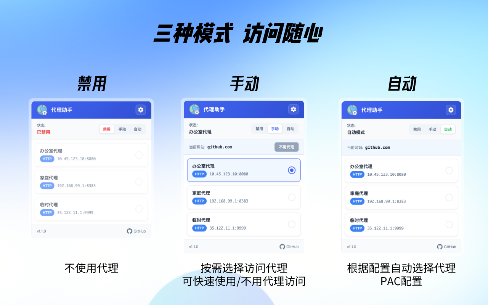
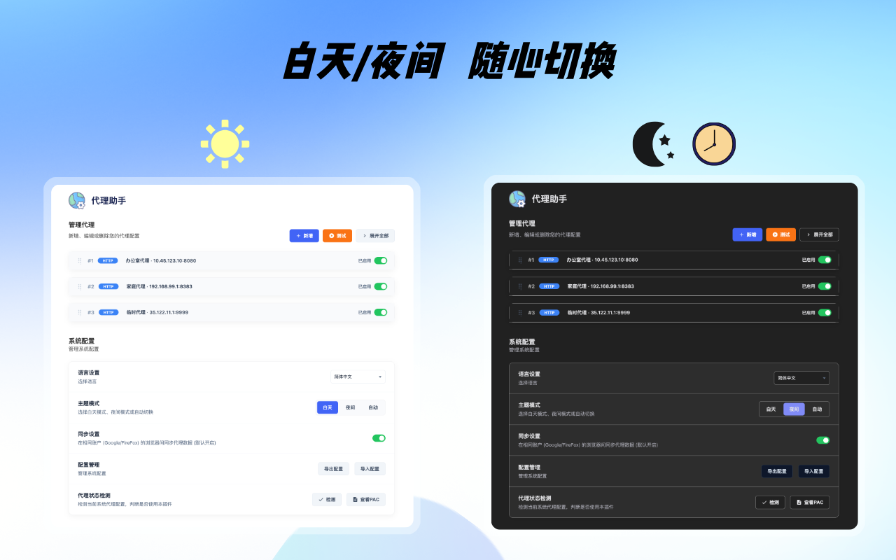
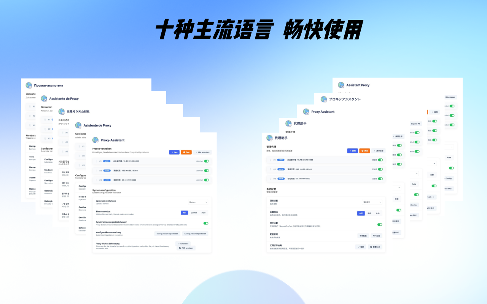
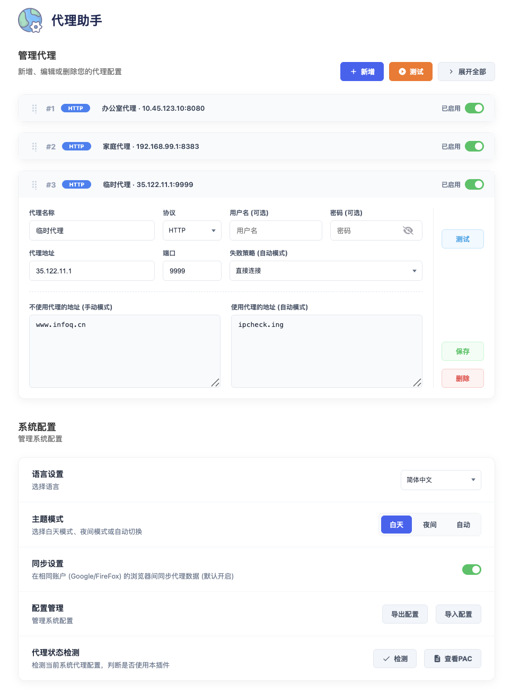

<div align="center">


# Asistente de Proxy

</div>

<div align="center">

[](https://chrome.google.com/webstore)
[](https://addons.mozilla.org/)
[](https://developer.chrome.com/docs/extensions/mv3/intro/)
[](README-es.md)

</div>

<div align="center">

[简体中文](../README.md) | [繁體中文](README-zh-TW.md) | [English](README-en.md) | [日本語](README-ja.md) | [Français](README-fr.md) | [Deutsch](README-de.md) | [**Español**](README-es.md) | [Português](README-pt.md) | [Русский](README-ru.md) | [한국어](README-ko.md)

</div>

<div align="center">

Una potente extensión de gestión de proxy para navegador que soporta Chrome/Firefox/Edge y otros navegadores múltiples, con gestión de múltiples escenarios, facilitando la configuración y conmutación de proxies de red.

</div>


## 1. ✨ Características

### 1.1 🔌 Soporte de múltiples protocolos proxy
- **HTTP** - Proxy HTTP tradicional
- **HTTPS** - Proxy HTTPS seguro
- **SOCKS5** - Proxy SOCKS5 con soporte TCP/UDP
- **SOCKS4** - Compatibilidad con proxy SOCKS4 heredado

### 1.2 🌐 Soporte multi-navegador
- **Chrome** - Usando Manifest V3 + Service Worker
- **Firefox** - Usando Manifest V3 + API `proxy.onRequest` para interceptación de solicitudes proxy
- **Edge** - Totalmente compatible con extensiones de Chrome, basado en kernel Chromium

### 1.3 🔄 Tres modos de proxy

| Modo | Descripción |
|------|-------------|
| **Desactivar** | Desactivar proxy, usar conexión de red predeterminada del sistema |
| **Manual** | Seleccionar manualmente un proxy de la lista |
| **Automático** | Seleccionar automáticamente el proxy correspondiente según reglas de URL (modo PAC) |



### 1.4 🎬 Modo Escenario

- **Soporte Multi-escenario**: Crear diferentes conjuntos de configuraciones de proxy (ej: Empresa, Hogar, Entorno de desarrollo)
- **Cambio Rápido**: Cambio con un clic de listas de proxy entre diferentes escenarios
- **Gestión Flexible**: Soporte para agregar, renombrar, eliminar y ordenar escenarios
- **Migración de Proxy**: Soporte para mover proxies entre diferentes escenarios
- **Aplicación automática**: Selección y aplicación automática de proxy al cambiar de escenario en modo manual

### 1.5 📥 Función de suscripción de proxy

- **Soporte multi-formato**: Soporta formatos de suscripción AutoProxy, SwitchyLegacy, SwitchyOmega, PAC
- **Actualización automática**: Soporta actualización automática programada (1min/6h/12h/1día)
- **Inversión de reglas**: Soporta inversión de reglas de coincidencia y omisión de suscripción (modo lista blanca/negra)
- **Vista previa de reglas**: Visualización rápida de reglas de coincidencia y omisión extraídas de la suscripción
- **ID único**: Cada proxy y escenario tiene un ID único para gestión precisa

### 1.6 📋 Configuración flexible de reglas URL

- **Direcciones que omiten el proxy** (`bypass_rules`): Dominios/IPs de conexión directa en modo manual
- **Direcciones que usan el proxy** (`include_rules`): Dominios que requieren acceso proxy en modo automático
- **Estrategia de fallback**: En modo automático, elegir conexión directa o rechazo cuando falla la conexión
- Soporta comodín `*` y coincidencia de dominio
- Ideal para escenarios donde diferentes sitios web usan diferentes proxies

### 1.7 🔐 Soporte de autenticación proxy

- Autenticación con nombre de usuario/contraseña
- Manejo automático de solicitudes de autenticación del servidor proxy
- Almacenamiento seguro de credenciales

### 1.8 🧪 Funciones de prueba de proxy

- **Prueba de conexión**: Verificar disponibilidad del proxy
- **Medición de latencia**: Probar tiempo de respuesta del proxy
- **Prueba en lote**: Probar todos los proxies con un clic
- **Indicadores de color**: Verde(<500ms) / Naranja(≥500ms) / Rojo(Fallido)

### 1.9 🏃 Detección de estado del proxy

- Detectar la configuración actual del proxy del navegador
- Verificar si la extensión controló exitosamente el proxy
- Identificar otras extensiones que controlan el proxy
- Proporcionar tres resultados: estado, advertencia, error

### 1.10 🔍 Vista previa del script PAC

- **Visualización de scripts**: Ver el contenido del script PAC generado automáticamente
- **Lista de reglas**: Visualización clara de todas las reglas de coincidencia de proxy activas
- **Soporte de depuración**: Solución fácil de problemas de coincidencia en modo automático

### 1.11 🌙 Modos de tema

- **Modo Claro**: Para uso diurno
- **Modo Oscuro**: Para uso nocturno
- **Cambio automático**: Cambiar tema automáticamente según la hora (horario configurable)



### 1.12 ☁️ Almacenamiento y sincronización de datos

#### 1.12.1 Estrategia de almacenamiento

| Tipo de almacenamiento | Contenido de almacenamiento | Descripción |
|------------------------|-----------------------------|-------------|
| **Almacenamiento local (local)** | Lista de proxies, configuración de tema, configuración de idioma, configuración de sincronización | Siempre activo, asegurando disponibilidad sin conexión y persistencia de datos |
| **Sincronización en la nube (sync)** | Datos de configuración completos (almacenamiento por fragmentos) | Opcional, utiliza almacenamiento por fragmentos para evitar límites de cuota |

#### 1.12.2 Métodos de sincronización

##### 1.12.2.1 Sincronización nativa del navegador (Native Sync)
- Usa la API `chrome.storage.sync` (Chrome) o `browser.storage.sync` (Firefox)
- Sincronización automática a través de la cuenta de Chrome/Firefox
- Adecuado para sincronización multi-dispositivo con la misma cuenta del navegador
- **Almacenamiento por fragmentos**: Los datos de configuración se fragmentan automáticamente (7KB por fragmento) para evitar el límite de cuota de 8KB por elemento
- **Integridad de datos**: Utiliza sumas de verificación para asegurar la integridad de los datos de sincronización
- **Operaciones atómicas**: La operación Push borra los datos antiguos antes de escribir los nuevos para asegurar la consistencia
- **Visualización de cuota**: Visualización en tiempo real de la cuota utilizada/total (100KB) y número de fragmentos

##### 1.12.2.2 Sincronización GitHub Gist
- Sincronización de configuración entre navegadores y dispositivos a través de GitHub Gist
- Requiere configurar GitHub Personal Access Token
- Soporta push/pull manual o sincronización automática
- El contenido de la configuración se almacena cifrado, la información sensible se borra automáticamente al exportar

| Elemento de configuración | Descripción |
|---------------------------|-------------|
| **Clave de acceso** | GitHub Personal Access Token (debe tener permisos gist) |
| **Nombre de archivo** | Nombre de archivo en Gist, por defecto `proxy_assistant_config.json` |
| **ID de Gist** | Reconocimiento y guardado automático, no requiere entrada manual |

#### 1.12.3 Operaciones de sincronización

| Operación | Descripción |
|-----------|-------------|
| **Push** | Subir configuración local a la nube/Gist |
| **Pull** | Descargar configuración desde la nube/Gist a local |
| **Probar conexión** | Verificar la validez del Gist Token y el estado de la configuración |

#### 1.12.4 Importar/Exportar

- **Exportar configuración**: Generar archivo JSON con toda la información de proxy, configuraciones de tema, configuraciones de idioma, etc.
- **Importar configuración**: Soporte para restaurar configuración desde archivo JSON
- **Seguridad de datos**: El archivo de exportación borra automáticamente información sensible (Token, contraseña)
- **Compatibilidad de formato**: Soporta importación de archivos de configuración de versiones anteriores

### 1.13 🌍 Soporte multilingüe

Esta extensión soporta los siguientes idiomas:

| Idioma | Código | Estado |
|--------|--------|--------|
| 简体中文 | zh-CN | ✅ Soportado |
| 繁體中文 | zh-TW | ✅ Soportado |
| English | en | ✅ Soportado |
| 日本語 | ja | ✅ Soportado |
| Français | fr | ✅ Soportado |
| Deutsch | de | ✅ Soportado |
| Español | es | ✅ Soportado |
| Português | pt | ✅ Soportado |
| Русский | ru | ✅ Soportado |
| 한국어 | ko | ✅ Soportado |



## 2. 📷 Interfaz de configuración



## 3. 📁 Estructura del proyecto

```
ProxyAssistant/
├── conf/                     # Configuración de ejemplo
│   └── demo.json             # Archivo de configuración de ejemplo
├── readme/                   # Documentación multilingüe
│   ├── README-zh-TW.md       # Chino tradicional
│   ├── README-en.md          # Inglés
│   ├── README-ja.md          # Japonés
│   ├── README-fr.md          # Francés
│   ├── README-de.md          # Alemán
│   ├── README-es.md          # Español
│   ├── README-pt.md          # Portugués
│   ├── README-ru.md          # Ruso
│   └── README-ko.md          # Coreano
├── src/                      # Código fuente
│   ├── manifest_chrome.json  # Configuración extensión Chrome (Manifest V3)
│   ├── manifest_firefox.json # Configuración extensión Firefox
│   ├── main.html             # Página de configuración
│   ├── popup.html            # Página emergente
│   ├── _locales/             # Recursos de internacionalización
│   ├── js/
│   │   ├── main.js           # Lógica principal de página de configuración
│   │   ├── popup.js          # Lógica principal del popup
│   │   ├── worker.js         # Servicio en segundo plano (Chrome: Service Worker)
│   │   ├── i18n.js           # Soporte de internacionalización
│   │   ├── storage.js        # Módulo de gestión de almacenamiento
│   │   ├── proxy.js          # Módulo de gestión de proxy
│   │   ├── scenarios.js      # Módulo de gestión de escenarios
│   │   ├── sync.js           # Módulo de sincronización de datos
│   │   ├── subscription.js   # Módulo de función de suscripción
│   │   ├── theme.js          # Módulo de cambio de tema
│   │   ├── detection.js      # Módulo de detección de proxy
│   │   ├── validator.js      # Módulo de validación de datos
│   │   ├── language.js       # Módulo de selección de idioma
│   │   ├── utils.js          # Módulo de funciones utilitarias
│   │   ├── config.js         # Módulo de constantes de configuración
│   │   ├── version.js        # Módulo de gestión de versiones
│   │   └── jquery.js         # Biblioteca jQuery
│   ├── css/
│   │   ├── main.css          # Estilos de página de configuración (incl. componentes comunes)
│   │   ├── popup.css         # Estilos del popup
│   │   ├── theme.css         # Estilos de tema
│   │   ├── tabs.css          # Estilos de pestañas
│   │   └── eye-button.css    # Estilos de botón mostrar contraseña
│   └── images/               # Recursos de imágenes
│       ├── icon-16.png
│       ├── icon-32.png
│       ├── icon-48.png
│       ├── icon-128.png
│       └── logo-128.png
├── public/                   # Recursos públicos
│   └── img/                  # Imágenes promocionales y de demostración
├── tests/                    # Pruebas
│   ├── jest.config.js        # Configuración de Jest
│   ├── setup.js              # Configuración de entorno de prueba
│   ├── __mocks__/            # Archivos Mock
│   │   └── chrome.js         # Mock de API de Chrome
│   ├── unit/                 # Pruebas unitarias
│   ├── integration/          # Pruebas de integraciones
│   └── e2e/                  # Pruebas de extremo a extremo
├── script/                   # Scripts de compilación
│   └── build.sh              # Script de compilación de extensión
├── release/                  # Notas de versión
│   └── *.md                  # Registros de actualización de versiones
├── docs/                     # Directorio de documentación
├── build/                    # Directorio de salida de compilación
├── package.json              # Dependencias del proyecto
├── package-lock.json         # Bloqueo de versiones de dependencias
├── Makefile                  # Entrada de comandos de compilación
├── jest.config.js            # Configuración de Jest (apunta a tests/jest.config.js)
├── AGENTS.md                 # Guía de desarrollo
└── LICENSE                   # Licencia MIT
```
ProxyAssistant/
├── conf/                     # Configuración de ejemplo
│   └── demo.json             # Archivo de configuración de ejemplo
├── readme/                   # Documentación multilingüe
│   ├── README-zh-CN.md       # Chino simplificado
│   ├── README-zh-TW.md       # Chino tradicional
│   ├── README-en.md          # Inglés
│   ├── README-ja.md          # Japonés
│   ├── README-fr.md          # Francés
│   ├── README-de.md          # Alemán
│   ├── README-es.md          # Español
│   ├── README-pt.md          # Portugués
│   ├── README-ru.md          # Ruso
│   └── README-ko.md          # Coreano
├── src/                      # Código fuente
│   ├── manifest_chrome.json  # Configuración extensión Chrome (Manifest V3)
│   ├── manifest_firefox.json # Configuración extensión Firefox
│   ├── main.html             # Página de configuración
│   ├── popup.html            # Página emergente
│   ├── js/
│   │   ├── main.js           # Lógica principal de página de configuración
│   │   ├── popup.js          # Lógica principal del popup
│   │   ├── worker.js         # Servicio en segundo plano (Chrome: Service Worker)
│   │   ├── i18n.js           # Soporte de internacionalización
│   │   └── jquery.js         # Biblioteca jQuery
│   ├── css/
│   │   ├── main.css          # Estilos de página de configuración (incl. componentes comunes)
│   │   ├── popup.css         # Estilos del popup
│   │   ├── theme.css         # Estilos de tema
│   │   └── eye-button.css    # Estilos de botón mostrar contraseña
│   └── images/               # Recursos de imágenes
│       ├── icon-16.png
│       ├── icon-32.png
│       ├── icon-48.png
│       ├── icon-128.png
│       └── logo-128.png
├── public/                   # Recursos públicos
    └── img/                  # Imágenes promocionales y de demostración
├── tests/                    # Pruebas
│   ├── jest.config.js        # Configuración de Jest
│   ├── setup.js              # Configuración de entorno de prueba
│   ├── __mocks__/            # Archivos Mock
│   │   └── chrome.js         # Mock de API de Chrome
│   ├── unit/                 # Pruebas unitarias
│   ├── integration/          # Pruebas de integración
│   └── e2e/                  # Pruebas de extremo a extremo
├── script/                   # Scripts de compilación
│   └── build.sh              # Script de compilación de extensión
├── release/                  # Notas de versión
│   └── *.md                  # Registros de actualización de versiones
├── build/                    # Directorio de salida de compilación
├── package.json              # Dependencias del proyecto
├── package-lock.json         # Bloqueo de versiones de dependencias
├── Makefile                  # Entrada de comandos de compilación
├── jest.config.js            # Configuración de Jest (apunta a tests/jest.config.js)
└── AGENTS.md                 # Guía de desarrollo
```

## 4. 🚀 Inicio rápido

### 4.1 Instalación de la extensión

#### 4.1.1 Chrome

**Método 1 (Recomendado)**: Instalar desde la tienda oficial de Chrome
1. Abrir Chrome, visitar [Chrome Web Store](https://chrome.google.com/webstore)
2. Buscar "Asistente de Proxy"
3. Click en "Añadir a Chrome"

**Método 2**: Instalación local
- **Opción A (usar código fuente)**: Descargar código fuente, renombrar `src/manifest_chrome.json` a `manifest.json`, luego cargar el directorio `src`
- **Opción B (usar paquete)**:
  1. Ir a la página [GitHub Releases](https://github.com/bugwz/ProxyAssistant/releases)
  2. Descargar el archivo `proxy-assistant-chrome-x.x.x.zip`
  3. Extraer el archivo ZIP descargado en un directorio任意
  4. Abrir Chrome, visitar `chrome://extensions/`
  5. Activar el **"Modo de desarrollador"** en la parte superior derecha
  6. Click en el botón **"Cargar extensión descomprimida"** en la parte superior izquierda
  7. Seleccionar la carpeta extraída en el paso 3
  8. La extensión aparecerá en la lista de extensiones después de una instalación exitosa

#### 4.1.2 Firefox

**Método 1 (Recomendado)**: Instalar desde complementos oficiales de Firefox
1. Abrir Firefox, visitar [Complementos de Firefox](https://addons.mozilla.org/)
2. Buscar "Asistente de Proxy"
3. Click en "Añadir a Firefox"

**Método 2**: Instalación local
1. Descargar el paquete de instalación de Firefox (archivo `.xpi`) del directorio `release`
2. Abrir Firefox, visitar `about:addons`
3. Click en **ícono de engranaje** → **Instalar complemento desde archivo**
4. Seleccionar el archivo `.xpi` descargado

#### 4.1.3 Microsoft Edge

El navegador Edge está basado en el núcleo Chromium y puede instalar extensiones de Chrome directamente.

**Método 1 (Recomendado)**: Instalar desde Chrome Web Store
1. Abrir Edge, visitar `edge://extensions/`
2. En la sección "Encontrar nuevas extensiones", click en "Obtener extensiones de Chrome Web Store", visitar [Chrome Web Store](https://chrome.google.com/webstore)
3. Buscar "Asistente de Proxy"
4. Click en "Obtener" y luego "Añadir a Microsoft Edge"

**Método 2**: Instalación local
1. Ir a la página [GitHub Releases](https://github.com/bugwz/ProxyAssistant/releases)
2. Descargar el archivo `proxy-assistant-chrome-x.x.x.zip`
3. Extraer el archivo ZIP descargado en un directorio任意
4. Abrir Edge, visitar `edge://extensions/`
5. Activar el **"Modo de desarrollador"** en la parte inferior izquierda
6. Click en el botón **"Seleccionar directorio descomprimido"**
7. Seleccionar la carpeta extraída en el paso 3
8. La extensión aparecerá en la lista de extensiones después de una instalación exitosa

### 4.2 Añadir un proxy

1. Click en el icono de la extensión para abrir el popup
2. Click en el botón **"Configuración"** para abrir la página de configuración
3. Click en el botón **"Nuevo proxy"** para añadir un nuevo proxy
4. Rellenar la información del proxy:
   - Nombre del proxy
   - Tipo de protocolo (HTTP/HTTPS/SOCKS4/SOCKS5)
   - Dirección del proxy (IP o dominio)
   - Puerto
   - (Opcional) Nombre de usuario y contraseña
   - (Opcional) Configuración de reglas URL
5. Click en el botón **"Guardar"**

### 4.3 Usar proxies

**Modo Manual**:
1. Seleccionar **"Manual"** en el popup
2. Seleccionar el proxy de la lista
3. El estado "Conectado" indica que está activo

**Modo Automático**:
1. Seleccionar **"Automático"** en el popup
2. Configurar reglas URL para cada proxy en la página de configuración
3. El proxy se selecciona automáticamente según el sitio web visitado

## 5. 🛠️ Guía de desarrollo

### 5.1 Entorno de desarrollo

**Requisitos previos**:
- Node.js >= 14
- npm >= 6
- Navegador Chrome / Firefox (para pruebas)
- web-ext (para construir XPI de Firefox, opcional)

**Instalar dependencias**:
```bash
make test_init
# o
npm install
```

### 5.2 Comandos de prueba

| Comando | Descripción |
|---------|-------------|
| `make test` | Ejecutar todas las pruebas (unitaria + integración + e2e) |
| `make test_nocache` | Ejecutar pruebas sin caché |
| `make test_unit` | Ejecutar solo pruebas unitarias |
| `make test_integration` | Ejecutar solo pruebas de integración |
| `make test_e2e` | Ejecutar solo pruebas e2e |
| `make test_clean` | Limpiar caché de pruebas y archivos de cobertura |

**Uso directo de npm**:
```bash
npm test                    # Ejecutar todas las pruebas
npm run test:unit           # Ejecutar solo pruebas unitarias
npm run test:integration    # Ejecutar solo pruebas de integración
npm run test:e2e            # Ejecutar solo pruebas e2e
npm run test:watch          # Ejecutar pruebas en modo watch
npm run test:coverage       # Ejecutar pruebas y generar informe de cobertura
```

### 5.3 Comandos de compilación

| Comando | Descripción |
|---------|-------------|
| `make build` | Construir extensiones Chrome y Firefox |
| `make clean` | Limpiar artefactos de compilación |
| `make test_clean` | Limpiar caché de pruebas y archivos de cobertura |

**Especificar versión**:
```bash
make build VERSION=dev
# o
./script/build.sh dev
```

**Artefactos de compilación**:
```
build/
├── ProxyAssistant_{VERSION}_chrome.zip      # Paquete de instalación Chrome
├── ProxyAssistant_{VERSION}_chrome.tar.gz   # Paquete fuente Chrome
├── ProxyAssistant_{VERSION}_firefox.zip     # Paquete de instalación Firefox
├── ProxyAssistant_{VERSION}_firefox.tar.gz  # Paquete fuente Firefox
└── ProxyAssistant_{VERSION}_firefox.xpi     # Paquete de extensión oficial Firefox
```

### 5.4 GitHub CI

El repositorio incluye un workflow de GitHub Actions CI en `.github/workflows/ci.yml`.

- Los `push` a la rama `main` ejecutan la CI
- Todos los eventos `pull_request` ejecutan la CI
- La CI se divide en cuatro jobs independientes: `unit`, `integration`, `e2e` y `build`
- Si el repositorio todavía no contiene archivos de prueba `integration` o `e2e`, esos jobs se omiten explícitamente en lugar de fallar

La CI usa actualmente los siguientes comandos:

```bash
npm run test:unit -- --no-cache
npm run test:integration -- --no-cache
npm run test:e2e -- --no-cache
make build VERSION=ci-<run-number>
```

El job `build` instala `web-ext`, ejecuta la compilación de la extensión en Ubuntu y sube los paquetes generados en `build/` como workflow artifacts.

### 5.5 Desarrollo local

**Instalación local Chrome**:
1. Renombrar `src/manifest_chrome.json` a `manifest.json`
2. Abrir Chrome, visitar `chrome://extensions/`
3. Activar **"Modo de desarrollador"**
4. Click en **"Cargar extensión descomprimida"**
5. Seleccionar directorio `src`

**Instalación local Firefox**:
1. Usar `make build` para generar archivo XPI
2. Abrir Firefox, visitar `about:addons`
3. Click en **ícono de engranaje** → **Instalar complemento desde archivo**
4. Seleccionar el archivo `.xpi` generado

### 5.6 Estilo de código

- **Indentación**: 2 espacios
- **Comillas**: Comillas simples
- **Nombres**: camelCase, constantes usan UPPER_SNAKE_CASE
- **Punto y coma**: Uso consistente

Para especificaciones detalladas, consulte [AGENTS.md](../AGENTS.md)

## 6. 📖 Documentación detallada

### 6.1 Sintaxis de reglas URL

Soporta las siguientes reglas de coincidencia:

```
# Coincidencia exacta
google.com

# Coincidencia de subdominio
.google.com
www.google.com

# Coincidencia con comodín
*.google.com
*.twitter.com

# Dirección IP
192.168.1.1
10.0.0.0/8
```

### 6.2 Estrategia de fallback

En modo automático, cuando la conexión del proxy falla:

| Estrategia | Descripción |
|------------|-------------|
| **Conexión directa (DIRECT)** | Omitir proxy, conectar directamente al sitio de destino |
| **Rechazar conexión (REJECT)** | Rechazar la solicitud |

### 6.3 Modo automático con script PAC

El modo automático usa scripts PAC (Proxy Auto-Config):
- Seleccionar automáticamente el proxy según la URL actual
- Coincidir en orden de lista de proxies, devolver el primer proxy coincidente
- Soporta estrategia de fallback
- Restaurar automáticamente la última configuración al iniciar el navegador

### 6.4 Atajos de operación

| Operación | Método |
|-----------|--------|
| Expandir/colapsar tarjeta proxy | Click en el encabezado de la tarjeta |
| Expandir/colapsar todas las tarjetas | Click en botón "Expandir/colapsar todo" |
| Reordenar proxy arrastrando | Arrastrar el mango en el encabezado de la tarjeta |
| Mostrar/ocultar contraseña | Click en el icono de ojo a la derecha del campo de contraseña |
| Habilitar/deshabilitar proxy individualmente | Toggle en la tarjeta |
| Probar proxy individual | Click en botón "Probar conexión" |
| Probar todos los proxies | Click en botón "Probar todo" |
| Cerrar popup rápidamente | Presionar la tecla `ESC` en la página |

### 6.5 Importar/exportar configuración

1. **Exportar configuración**: Click en "Exportar configuración" para descargar archivo JSON
2. **Importar configuración**: Click en "Importar configuración" y seleccionar archivo JSON para restaurar

La configuración incluye:
- Toda la información del proxy
- Configuraciones de tema
- Horario de modo nocturno
- Configuración de idioma
- Estado de sincronización

### 6.6 Detección de estado del proxy

Click en el botón "Detectar estado del proxy" puede:
- Ver el modo actual del proxy del navegador
- Verificar si la extensión controló exitosamente el proxy
- Detectar si otras extensiones ocuparon el control
- Obtener diagnóstico y sugerencias de problemas

## 7. 🔧 Arquitectura técnica

### 7.1 Manifest V3

- Chrome usa especificación Manifest V3
- Service Worker代替 páginas de fondo
- Firefox usa background scripts + onRequest API
- Soporta almacenamiento de sincronización nativa del navegador y sincronización GitHub Gist

### 7.2 Módulos principales

| Módulo | Archivo | Descripción |
|--------|---------|-------------|
| **Principal** | main.js | Lógica de página de configuración, gestión de escenarios, proxy CRUD, ordenación arrastrando, import/export, detección de proxy |
| **Popup** | popup.js | Interacción con interfaz del popup, visualización de estado del proxy, cambio rápido de proxy, visualización de coincidencia automática |
| **Fondo** | worker.js | Gestión de configuración de proxy, generación de script PAC, manejo de autenticación, prueba de proxy, actualización automática de suscripción, vigilancia de cambios de almacenamiento |
| **Almacenamiento** | storage.js | Gestión de almacenamiento local/nube, sincronización por fragmentos, validación de datos, import/export de configuración |
| **i18n** | i18n.js | Soporte multilingüe, cambio en tiempo real, carga dinámica de traducciones |
| **Tema** | theme.js | Cambio de tema claro/oscuro, cambio automático según hora |
| **Escenarios** | scenarios.js | Soporte multi-escenario, cambio de escenario, renombrar/eliminar/ordenar escenarios |
| **Sincronización** | sync.js | Sincronización nativa del navegador, sincronización GitHub Gist |
| **Suscripción** | subscription.js | Análisis de suscripción proxy (AutoProxy/SwitchyLegacy/SwitchyOmega/PAC), actualización automática |
| **Proxy** | proxy.js | Renderizado de lista de proxies, edición, prueba, ordenación arrastrando |
| **Detección** | detection.js | Detección de estado del proxy, detección de control de extensión, detección de conflictos |
| **Validación** | validator.js | Validación de formato IP/dominio/puerto/regla |
| **Utilidades** | utils.js | Funciones utilitarias comunes, asistentes de operaciones DOM |
| **Idioma** | language.js | Manejo de interacción de menú desplegable de idioma |
| **Configuración** | config.js | Constantes de configuración predeterminadas, gestión de configuración del sistema |

### 7.3 Almacenamiento de datos

- `chrome.storage.local`: Almacenamiento local (siempre usado)
- `chrome.storage.sync`: Almacenamiento de sincronización en la nube (opcional)
- `chrome.storage.session`: Almacenamiento de sesión (información de autenticación, caché de estado)
- Principio de local first, resuelve problema de cuota de sincronización
- Almacenamiento por fragmentos (7KB por fragmento) evita límite de cuota de 8KB

### 7.4 Versión del formato de configuración

| Versión | Descripción |
|---------|-------------|
| v1 | Formato inicial |
| v2 | Agregado soporte de escenarios |
| v3 | Agregado soporte de suscripción |
| v4 | Estado de desactivación de proxy unificado, uso de IDs únicos, inversión de reglas de suscripción |

### 7.5 Compatibilidad de navegador

| Función | Chrome | Firefox |
|---------|--------|---------|
| Modo Manual | ✅ | ✅ |
| Modo Automático | ✅ | ✅ |
| Autenticación proxy | ✅ | ✅ |
| Prueba proxy | ✅ | ✅ |
| Cambio de tema | ✅ | ✅ |
| Sincronización de datos | ✅ | ✅ |
| Detección proxy | ✅ | ✅ |
| Suscripción | ✅ | ✅ |

### 7.6 Tecnologías principales de implementación

- **JavaScript nativo + jQuery**: Sin dependencia de framework, ligero
- **Manifest V3**: Chrome usa Service Worker, Firefox usa background scripts
- **Script PAC**: Script de configuración automática de proxy generado dinámicamente en modo automático
- **Autenticación proxy**: Usa API `webRequestAuthProvider` para manejar solicitudes de autenticación
- **Sincronización por fragmentos**: Algoritmo de fragmentación personalizado para resolver límites de cuota de Chrome storage.sync
- **Análisis de suscripción**: Soporta análisis y conversión automáticos de múltiples formatos de suscripción

## 8. 📝 Casos de uso

### 8.1 Escenario 1: Cambio entre múltiples proxies

- Configurar diferentes proxies para diferentes entornos de red
- Usar proxy de empresa para red de oficina
- Usar proxy científico para red doméstica
- Cambio rápido con un clic

### 8.2 Escenario 2: Enrutamiento inteligente

- Sitios web nacionales conexión directa
- Sitios específicos a través de proxy
- Selección automática basada en dominio

### 8.3 Escenario 3: Prueba de pool de proxies

- Importar múltiples proxies
- Probar latencia en lote
- Seleccionar proxy óptimo para usar

### 8.4 Escenario 4: Compartición en equipo

- Exportar archivo de configuración
- Compartir con miembros del equipo
- Configuración de proxy unificada

## 9. ⚠️ Notas importantes

1. **Descripción de permisos**: La extensión requiere los siguientes permisos:
   - `proxy`: Gestionar configuraciones de proxy
   - `storage`: Almacenar configuraciones
   - `webRequest` / `webRequestAuthProvider`: Manejar solicitudes de autenticación
   - `<all_urls>`: Acceder a todas las URLs de sitios web

2. **Conflictos con otras extensiones**: Si hay conflictos de proxy, desactivar otras extensiones proxy/VPN

3. **Seguridad**: Las credenciales se almacenan localmente en el navegador, por favor asegurar la seguridad del dispositivo

4. **Requisitos de red**: Asegurarse de que el servidor proxy sea accesible normalmente

5. **Restricción de Firefox**: La versión mínima de Firefox requerida es 142.0

## 10. 📄 Política de privacidad

[Política de privacidad](https://sites.google.com/view/proxy-assistant/privacy-policy)

## 11. 📄 Licencia

MIT License - Ver archivo [LICENSE](../LICENSE) para detalles

## 12. 🤝 Contribución

¡Informes de issues y pull requests son bienvenidos!

## 13. 📧 Contacto

Para preguntas o sugerencias, por favor enviar comentarios a través de GitHub Issues.

---

<div align="center">

**Si este proyecto te ha sido útil, ¡agradeceríamos un Star ⭐ para apoyar!**

</div>
