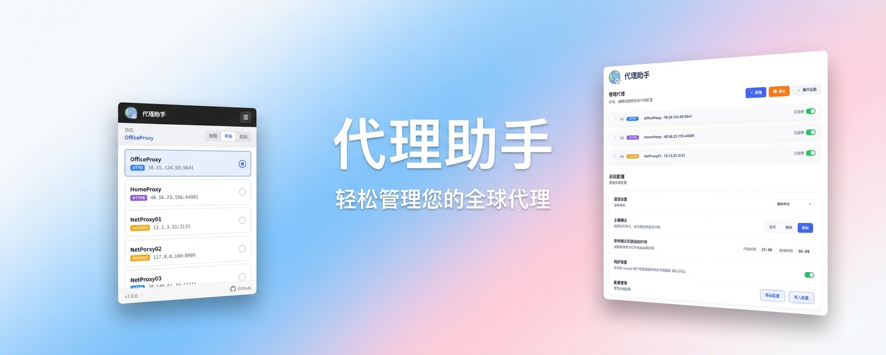

<div align="center">


# 代理助手

</div>

<div align="center">

[](https://chrome.google.com/webstore)
[](https://developer.chrome.com/docs/extensions/mv3/intro/)
[](README-en.md)

</div>

<div align="center">

[简体中文](../README.md) | [**繁體中文**](README-zh-TW.md) | [English](README-en.md) | [日本語](README-ja.md) | [Français](README-fr.md) | [Deutsch](README-de.md) | [Español](README-es.md) | [Português](README-pt.md) | [Русский](README-ru.md) | [한국어](README-ko.md)

</div>

<div align="center">

一款功能強大的Chrome瀏覽器代理管理擴展，輕鬆配置和切換網絡代理。
</div>



## ✨ 功能特性

### 🔌 多種代理協議支持
- **HTTP** - 傳統HTTP代理
- **HTTPS** - 安全HTTPS代理
- **SOCKS5** - 支持TCP/UDP的SOCKS5代理
- **SOCKS4** - 兼容舊版SOCKS4代理

### 🔄 三種代理模式

| 模式 | 說明 |
|------|------|
| **禁用** | 關閉代理，使用系統默認網絡連接 |
| **手動** | 從代理列表中手動選擇要使用的代理 |
| **自動** | 根據URL規則自動選擇匹配的代理（PAC模式） |

|  |  |  |
|:---:|:---:|:---:|
| 禁用模式 | 手動模式 | 自動模式 |

### 📋 靈活的URL規則配置

- **不使用代理的地址** (`bypass_urls`): 直接連接的域名/IP
- **使用代理的地址** (`include_urls`): 需要通過代理訪問的域名
- 支持通配符 `*` 和域名匹配
- 適用於不同網站使用不同代理的場景

### 🔐 代理認證支持

- 用戶名/密碼認證支持
- 自動處理代理服務器的認證請求
- 安全存儲憑證信息

### 🧪 代理測試功能

- **連接測試**: 驗證代理是否可用
- **延遲測量**: 測試代理響應時間
- **批量測試**: 一鍵測試所有代理
- **顏色標識**: 綠色(<500ms) / 橙色(≥500ms) / 紅色(失敗)

### 🌙 主題模式

- **淺色模式**: 白天使用
- **深色模式**: 夜間使用
- **自動切換**: 根據時間自動切換主題

|  |  |
|:---:|:---:|
| 淺色模式 | 深色模式 |

### ☁️ 數據同步

- **Google帳戶同步**: 在多設備間同步代理配置
- **本地存儲**: 可選擇僅本地保存

### 🌍 多語言支持

本擴展支持以下 5 種語言：

| 語言 | 代碼 | 支持狀態 |
|------|------|----------|
| 簡體中文 | zh-CN | ✅ 已支持 |
| 繁體中文 | zh-TW | ✅ 已支持 |
| English | en | ✅ 已支持 |
| 日本語 | ja | ✅ 已支持 |
| Français | fr | ✅ 已支持 |

## 📷 設置界面


## 📁 項目結構

```
ProxyAssistant/
├──                     # 多語言文檔
│   ├── README-zh-CN.md       # 簡體中文
│   ├── README-zh-TW.md       # 繁體中文
│   ├── README-en.md          # 英文
│   └── ...
├── src/                       # 源代碼
│   ├── manifest.json         # Chrome擴展配置
│   ├── main.html             # 設置頁面
│   ├── popup.html            # 彈窗頁面
│   ├── js/
│   │   ├── main.js           # 設置頁主邏輯
│   │   ├── popup.js          # 彈窗主邏輯
│   │   ├── service-worker.js # 後台服務（代理核心邏輯）
│   │   ├── i18n.js           # 國際化支持
│   │   └── jquery.js         # jQuery庫
│   ├── css/
│   │   ├── main.css          # 設置頁樣式
│   │   ├── popup.css         # 彈窗樣式
│   │   ├── theme.css         # 主題樣式
│   │   ├── switch.css        # 開關組件樣式
│   │   ├── delete-button.css # 刪除按鈕樣式
│   │   └── eye-button.css    # 密碼可見按鈕樣式
│   └── images/               # 圖標資源
│       ├── icon-16.png
│       ├── icon-32.png
│       ├── icon-48.png
│       ├── icon-128.png
│       ├── logo-128.png
│       ├── demo.png
│       ├── demo-light.png
│       ├── demo-night.png
│       ├── demo-popup-01.png
│       ├── demo-popup-02.png
│       ├── demo-popup-03.png
│       └── promotion/
│           └── 1400-560-big.jpeg
└── public/                   # 公共資源
    └── ...
```

## 🚀 快速開始

### 安裝擴展

1. 打開Chrome瀏覽器，訪問 `chrome://extensions/`
2. 開啟右上角的 **"開發者模式"**
3. 點擊 **"加載已解壓的擴展程序"**
4. 選擇項目的 `ProxyAssistant/src` 文件夾

### 添加代理

1. 點擊擴展圖標打開彈窗
2. 點擊 **"設置"** 按鈕進入設置頁面
3. 點擊 **"新增"** 按鈕添加新代理
4. 填寫代理信息：
   - 代理名稱
   - 協議類型 (HTTP/HTTPS/SOCKS5)
   - 代理地址 (IP或域名)
   - 端口號
   - (可選) 用戶名和密碼
5. 點擊 **"保存"** 按鈕

### 使用代理

**手動模式**:
1. 在彈窗中選擇 **"手動"** 模式
2. 從列表中選擇要使用的代理
3. 狀態顯示已連接即表示生效

**自動模式**:
1. 在彈窗中選擇 **"自動"** 模式
2. 在設置頁面為每個代理配置URL規則
3. 訪問網站時自動選擇匹配的代理

## 📖 詳細說明

### URL規則語法

支持以下匹配規則：

```
# 精確匹配
google.com

# 子域名匹配
.google.com
www.google.com

# 通配符匹配
*.google.com
*.twitter.com

# IP地址
192.168.1.1
10.0.0.0/8
```

### PAC腳本自動模式

自動模式使用PAC (Proxy Auto-Config) 腳本：
- 根據當前訪問的URL自動選擇代理
- 支持失敗回退策略（直接連接或拒絕連接）
- 瀏覽器啟動時自動恢復上次配置

### 快捷操作

| 操作 | 方式 |
|------|------|
| 展開/折疊代理卡片 | 點擊卡片頭部 |
| 展開/折疊全部卡片 | 點擊"展開全部"按鈕 |
| 拖動排序代理 | 拖動卡片頭部的拖拽手柄 |
| 顯示/隱藏密碼 | 點擊密碼框右側眼睛圖標 |
| 測試單個代理 | 點擊"測試"按鈕 |
| 測試全部代理 | 點擊"測試全部"按鈕 |

### 導入導出配置

1. **導出配置**: 點擊"導出配置"下載JSON文件
2. **導入配置**: 點擊"導入配置"選擇JSON文件恢復

配置包含：
- 所有代理信息
- 主題設置
- 同步設置

## 🔧 技術架構

### Manifest V3

- 使用Chrome擴展Manifest V3規範
- Service Worker代替後台頁面
- 更安全、更高效的架構

### 核心模塊

1. **service-worker.js**:
   - 代理配置管理
   - PAC腳本生成
   - 認證處理
   - 代理測試邏輯

2. **popup.js**:
   - 彈窗界面交互
   - 代理狀態顯示
   - 快速切換代理

3. **main.js**:
   - 設置頁面邏輯
   - 代理管理（增刪改）
   - 拖拽排序
   - 導入導出

4. **i18n.js**:
   - 多語言支持
   - 實時語言切換

### 數據存儲

- `chrome.storage.local`: 本地存儲
- `chrome.storage.sync`: 雲端同步存儲
- 自動處理存儲配額

## 📝 使用場景

### 場景1: 多代理切換

- 為不同網絡環境配置不同代理
- 辦公室網絡使用公司代理
- 家庭網絡使用科學上網代理
- 快速一鍵切換

### 場景2: 智能路由

- 國內網站直連
- 特定網站走代理
- 根據域名自動選擇

### 場景3: 代理池測試

- 導入多個代理
- 批量測試延遲
- 選擇最優代理使用

### 場景4: 團隊共享

- 導出配置文件
- 分享給團隊成員
- 統一代理配置

## ⚠️ 注意事項

1. **權限說明**: 擴展需要以下權限：
   - `proxy`: 管理代理設置
   - `storage`: 存儲配置
   - `webRequest`: 處理認證請求
   - `<all_urls>`: 訪問所有網站URL

2. **其他擴展衝突**: 如遇代理衝突，請關閉其他代理類擴展

3. **安全性**: 憑證信息存儲在瀏覽器本地，請確保設備安全

4. **網絡要求**: 確保代理服務器可正常訪問

## 📄 許可證

MIT License - 詳見 [LICENSE](../LICENSE) 文件

## 🤝 貢獻

歡迎提交Issue和Pull Request！

## 📧 聯繫

如有問題或建議，請通過GitHub Issues反饋。
