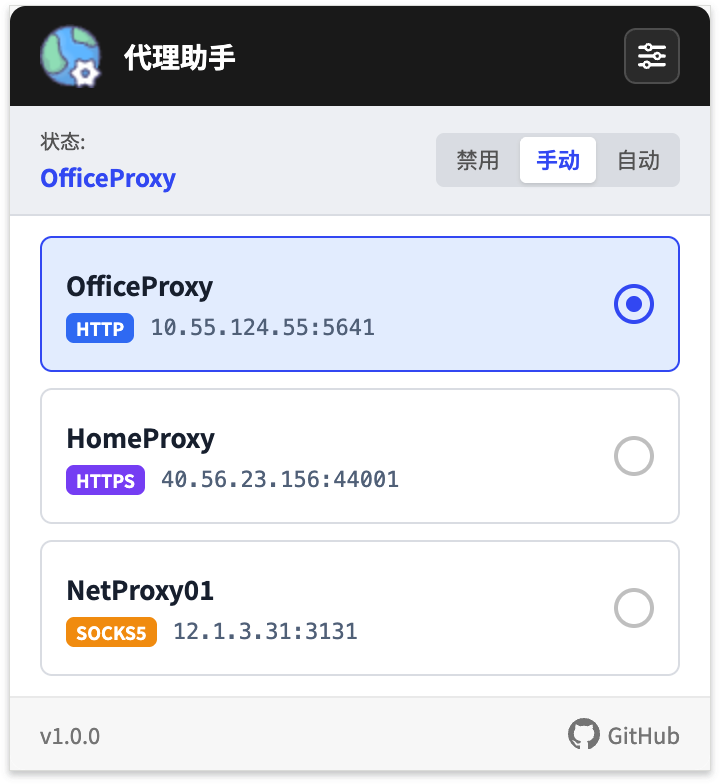
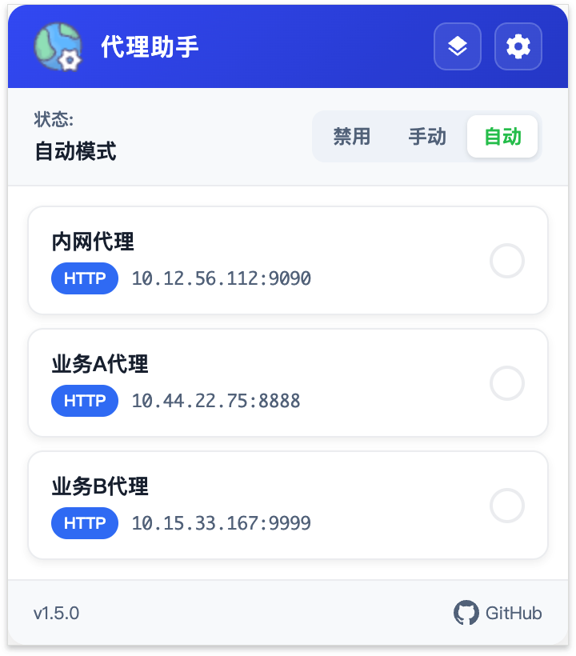
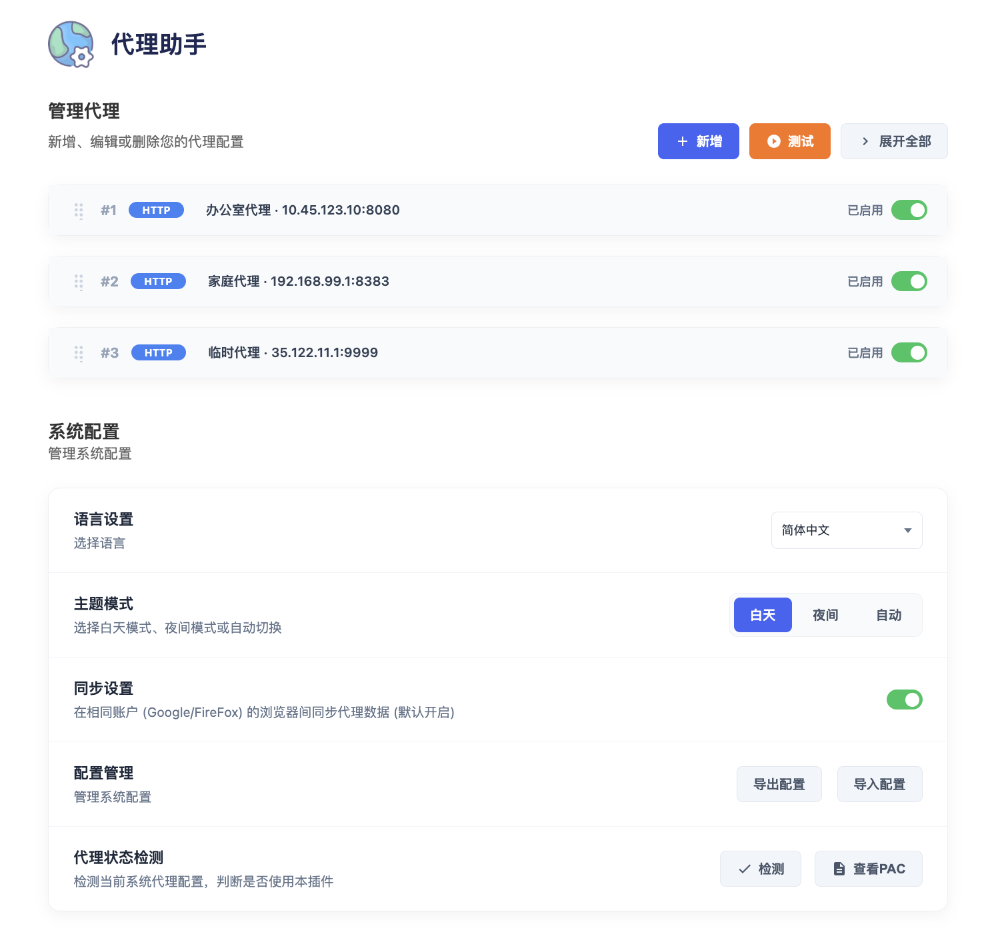
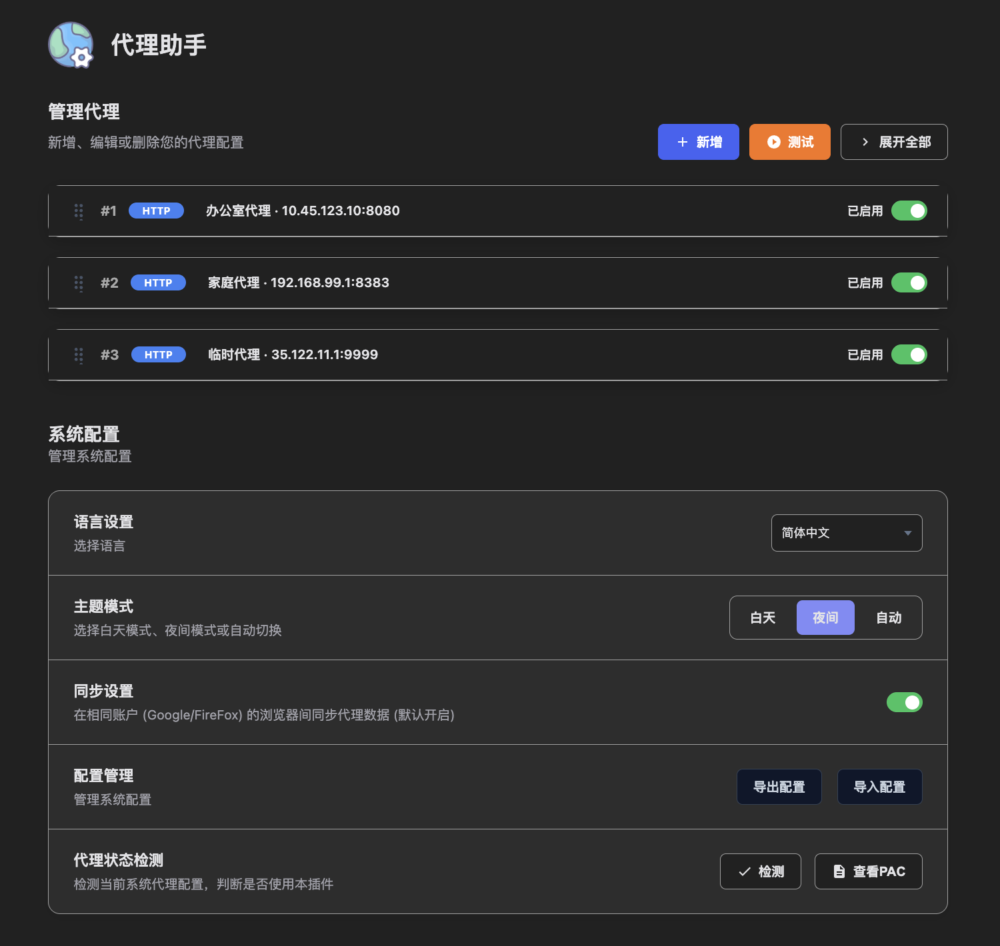

<div align="center">


# 代理助手

</div>

<div align="center">

[](https://chrome.google.com/webstore)
[](https://addons.mozilla.org/)
[](https://developer.chrome.com/docs/extensions/mv3/intro/)
[](README-zh-TW.md)

</div>

<div align="center">

[簡體中文](../README.md) | [**繁體中文**](README-zh-TW.md) | [English](README-en.md) | [日本語](README-ja.md) | [Français](README-fr.md) | [Deutsch](README-de.md) | [Español](README-es.md) | [Português](README-pt.md) | [Русский](README-ru.md) | [한국어](README-ko.md)

</div>

<div align="center">

一款功能強大的瀏覽器代理管理擴展，支持 Chrome 和 Firefox，輕鬆配置和切換網絡代理。

</div>


## ✨ 功能特性

### 🔌 多種代理協議支持
- **HTTP** - 傳統HTTP代理
- **HTTPS** - 安全HTTPS代理
- **SOCKS5** - 支持TCP/UDP的SOCKS5代理
- **SOCKS4** - 兼容舊版SOCKS4代理

### 🌐 多瀏覽器支持
- **Chrome** - 使用 Manifest V3 + Service Worker
- **Firefox** - 使用 onRequest API 實現代理攔截

### 🔄 三種代理模式

| 模式 | 說明 |
|------|------|
| **禁用** | 關閉代理，使用系統默認網絡連接 |
| **手動** | 從代理列表中手動選擇要使用的代理 |
| **自動** | 根據URL規則自動選擇匹配的代理（PAC模式） |

|  |  |  |
|:---:|:---:|:---:|
| 禁用模式 | 手動模式 | 自動模式 |

### 📋 靈活的URL規則配置

- **不使用代理的地址** (`bypass_urls`): 手動模式下直接連接的域名/IP
- **使用代理的地址** (`include_urls`): 自動模式下需要通過代理訪問的域名
- **失敗回退策略**: 自動模式下連接失敗時選擇直接連接或拒絕連接
- 支持通配符 `*` 和域名匹配
- 適用於不同網站使用不同代理的場景

### 🔐 代理認證支持

- 用戶名/密碼認證支持
- 自動處理代理服務器的認證請求
- 安全存儲憑證信息

### 🧪 代理測試功能

- **連接測試**: 驗證代理是否可用
- **延遲測量**: 測試代理響應時間
- **批量測試**: 一鍵測試所有代理
- **顏色標識**: 綠色(<500ms) / 橙色(≥500ms) / 紅色(失敗)

### 🏃 代理狀態檢測

- 檢測當前瀏覽器代理設置
- 驗證擴展是否成功控制代理
- 識別其他擴展對代理的控制
- 提供狀態、警告、錯誤三種結果

### 🔍 PAC 腳本預覽

- **腳本查看**: 查看自動生成的 PAC 腳本內容
- **規則列表**: 清晰展示所有生效的代理匹配規則
- **調試支持**: 方便排查自動模式下的匹配問題

### 🌙 主題模式

- **淺色模式**: 白天使用
- **深色模式**: 夜間使用
- **自動切換**: 根據時間自動切換主題（可配置時段）

|  |  |
|:---:|:---:|
| 淺色模式 | 深色模式 |

### ☁️ 數據存儲與同步

- **本地優先存儲**: 代理配置始終保存到本地存儲
- **雲端同步**: 可選啟用 Chrome/Firefox 帳戶同步
- **智能合併**: 同步異常時自動合併本地和遠程數據
- **導入導出**: 支持 JSON 格式的配置備份與恢復

### 🌍 多語言支持

本擴展支持以下語言：

| 語言 | 代碼 | 支持狀態 |
|------|------|----------|
| 簡體中文 | zh-CN | ✅ 已支持 |
| 繁體中文 | zh-TW | ✅ 已支持 |
| English | en | ✅ 已支持 |
| 日本語 | ja | ✅ 已支持 |
| Français | fr | ✅ 已支持 |
| Deutsch | de | ✅ 已支持 |
| Español | es | ✅ 已支持 |
| Português | pt | ✅ 已支持 |
| Русский | ru | ✅ 已支持 |
| 한국어 | ko | ✅ 已支持 |

## 📷 設置界面


## 📁 項目結構

```
ProxyAssistant/
├── readme/                    # 多語言文檔
│   ├── README-zh-CN.md       # 簡體中文
│   ├── README-zh-TW.md       # 繁體中文
│   ├── README-en.md          # 英文
│   └── ...
├── src/                       # 源代碼
│   ├── manifest_chrome.json  # Chrome 擴展配置
│   ├── manifest_firefox.json # Firefox 擴展配置
│   ├── main.html             # 設置頁面
│   ├── popup.html            # 彈窗頁面
│   ├── js/
│   │   ├── worker.js         # 後台服務（Chrome: Service Worker）
│   │   ├── popup.js          # 彈窗主邏輯
│   │   ├── main.js           # 設置頁主邏輯
│   │   ├── i18n.js           # 國際化支持
│   │   └── jquery.js         # jQuery庫
│   ├── css/
│   │   ├── main.css          # 設置頁樣式（含通用組件樣式）
│   │   ├── popup.css         # 彈窗樣式
│   │   ├── theme.css         # 主題樣式
│   │   └── eye-button.css    # 密碼可見按鈕樣式
│   └── images/               # 圖標資源
│       ├── icon-16.png
│       ├── icon-32.png
│       ├── icon-48.png
│       ├── icon-128.png
│       └── logo-128.png
└── public/                   # 公共資源
    └── img/                  # 演示與宣傳圖片
```

## 🚀 快速開始

### 安裝擴展

**Chrome:**

方式一（推薦）：從 Chrome 官方擴展商店安裝
1. 打開 Chrome 瀏覽器，訪問 [Chrome 網上應用店](https://chrome.google.com/webstore)
2. 搜索"代理助手"
3. 點擊"添加至 Chrome"

方式二：本地安裝
- **方案 A（使用源碼）**：下載源碼，將 `src/manifest_chrome.json` 重命名為 `manifest.json`，然後加載 `src` 目錄
- **方案 B（使用安裝包）**：下載 release 目錄中的 Chrome 擴展安裝包（`.zip` 文件），解壓後加載對應目錄

**Firefox:**

方式一（推薦）：從 Firefox 官方附加組件安裝
1. 打開 Firefox 瀏覽器，訪問 [Firefox 附加組件](https://addons.mozilla.org/)
2. 搜索"代理助手"
3. 點擊"添加到 Firefox"

方式二：本地安裝
1. 下載 release 目錄中的 Firefox 擴展安裝包（`.xpi` 文件）
2. 打開 Firefox 瀏覽器，訪問 `about:addons`
3. 點擊 **齒輪圖標** → **從文件安裝附加組件**
4. 選擇下載的 `.xpi` 文件

### 添加代理

1. 點擊擴展圖標打開彈窗
2. 點擊 **"設置"** 按鈕進入設置頁面
3. 點擊 **"新增代理"** 按鈕添加新代理
4. 填寫代理信息：
   - 代理名稱
   - 協議類型 (HTTP/HTTPS/SOCKS4/SOCKS5)
   - 代理地址 (IP或域名)
   - 端口號
   - (可選) 用戶名和密碼
   - (可選) URL規則配置
5. 點擊 **"保存"** 按鈕

### 使用代理

**手動模式**:
1. 在彈窗中選擇 **"手動"** 模式
2. 從列表中選擇要使用的代理
3. 狀態顯示已連接即表示生效

**自動模式**:
1. 在彈窗中選擇 **"自動"** 模式
2. 在設置頁面為每個代理配置URL規則
3. 訪問網站時自動選擇匹配的代理

## 📖 詳細說明

### URL規則語法

支持以下匹配規則：

```
# 精確匹配
google.com

# 子域名匹配
.google.com
www.google.com

# 通配符匹配
*.google.com
*.twitter.com

# IP地址
192.168.1.1
10.0.0.0/8
```

### 失敗回退策略

在自動模式下，當代理連接失敗時：

| 策略 | 說明 |
|------|------|
| **直接連接 (DIRECT)** | 繞過代理，直接連接目標網站 |
| **拒絕連接 (REJECT)** | 拒絕該請求 |

### PAC腳本自動模式

自動模式使用 PAC (Proxy Auto-Config) 腳本：
- 根據當前訪問的URL自動選擇代理
- 按代理列表順序匹配，返回第一個匹配的代理
- 支持失敗回退策略
- 瀏覽器啟動時自動恢復上次配置

### 快捷操作

| 操作 | 方式 |
|------|------|
| 展開/折疊代理卡片 | 點擊卡片頭部 |
| 展開/折疊全部卡片 | 點擊"展開/折疊全部"按鈕 |
| 拖動排序代理 | 拖動卡片頭部的拖拽手柄 |
| 顯示/隱藏密碼 | 點擊密碼框右側眼睛圖標 |
| 單獨啟用/禁用代理 | 切換卡片上的開關 |
| 測試單個代理 | 點擊"連接測試"按鈕 |
| 測試全部代理 | 點擊"測試全部"按鈕 |

### 導入導出配置

1. **導出配置**: 點擊"導出配置"下載 JSON 文件
2. **導入配置**: 點擊"導入配置"選擇 JSON 文件恢復

配置包含：
- 所有代理信息
- 主題設置
- 夜間模式時段
- 語言設置
- 同步開關狀態

### 代理狀態檢測

點擊"檢測代理效果"按鈕可以：
- 查看當前瀏覽器代理模式
- 驗證擴展是否成功控制代理
- 檢測其他擴展是否搶佔控制權
- 獲得問題診斷和建議

## 🔧 技術架構

### Manifest V3

- Chrome 使用 Manifest V3 規範
- Service Worker 代替後台頁面
- Firefox 使用 background scripts + onRequest API

### 核心模塊

1. **worker.js (Chrome)**:
   - 代理配置管理
   - PAC腳本生成
   - 認證處理
   - 代理測試邏輯
   - 存儲變更監聽

2. **popup.js**:
   - 彈窗界面交互
   - 代理狀態顯示
   - 快速切換代理
   - 自動匹配顯示

3. **main.js**:
   - 設置頁面邏輯
   - 代理管理（增刪改）
   - 拖拽排序
   - 導入導出
   - 代理檢測功能

4. **i18n.js**:
   - 多語言支持
   - 實時語言切換

### 數據存儲

- `chrome.storage.local`: 本地存儲（始終使用）
- `chrome.storage.sync`: 雲端同步存儲（可選）
- 遵循本地優先原則，解決同步配額問題

### 瀏覽器兼容性

| 功能 | Chrome | Firefox |
|------|--------|---------|
| 手動模式 | ✅ | ✅ |
| 自動模式 | ✅ | ✅ |
| 代理認證 | ✅ | ✅ |
| 代理測試 | ✅ | ✅ |
| 主題切換 | ✅ | ✅ |
| 數據同步 | ✅ | ✅ |
| 代理檢測 | ✅ | ✅ |

## 📝 使用場景

### 場景1: 多代理切換

- 為不同網絡環境配置不同代理
- 辦公室網絡使用公司代理
- 家庭網絡使用科學上網代理
- 快速一鍵切換

### 場景2: 智能路由

- 國內網站直連
- 特定網站走代理
- 根據域名自動選擇

### 場景3: 代理池測試

- 導入多個代理
- 批量測試延遲
- 選擇最優代理使用

### 場景4: 團隊共享

- 導出配置文件
- 分享給團隊成員
- 統一代理配置

## ⚠️ 注意事項

1. **權限說明**: 擴展需要以下權限：
   - `proxy`: 管理代理設置
   - `storage`: 存儲配置
   - `webRequest` / `webRequestAuthProvider`: 處理認證請求
   - `<all_urls>`: 訪問所有網站URL

2. **其他擴展衝突**: 如遇代理衝突，請關閉其他代理/VPN類擴展

3. **安全性**: 憑證信息存儲在瀏覽器本地，請確保設備安全

4. **網絡要求**: 確保代理服務器可正常訪問

5. **Firefox 限制**: Firefox 最低版本要求 142.0

## 📄 隱私權政策

[隱私權政策](https://sites.google.com/view/proxy-assistant/privacy-policy)

## 📄 許可證

MIT License - 詳見 [LICENSE](../LICENSE) 文件

## 🤝 貢獻

歡迎提交 Issue 和 Pull Request！

## 📧 聯繫

如有問題或建議，請通過 GitHub Issues 反饋。

---

<div align="center">

**如果這個項目對您有幫助，歡迎 Star ⭐ 支持！**

</div>
